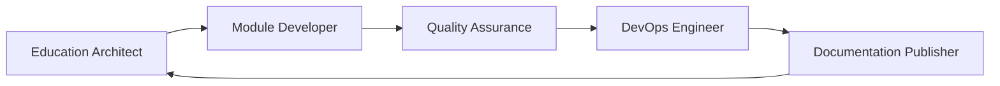

# TinyTorch Agent Reference

## Agent Team Structure

### Core Development Agents

#### 🟢 Module Developer
**Location**: `.claude/agents/module-developer.md`
**Responsibilities**:
- Implements modules with educational scaffolding
- Ensures NBGrader compatibility
- Creates immediate tests after implementations
- Follows 5 C's pattern for markdown

**Key Knowledge**:
- BEGIN/END SOLUTION blocks for student releases
- Scaffolding must be OUTSIDE solution blocks
- Test-immediately pattern is non-negotiable
- Every cell needs unique grade_id

#### 🟣 Education Architect  
**Location**: `.claude/agents/education-architect.md`
**Responsibilities**:
- Designs learning objectives and progression
- Creates pedagogical framework
- Ensures educational effectiveness
- Plans assessment strategies

**Key Knowledge**:
- NBGrader enables dual instructor/student versions
- 5 C's pattern for educational content
- Progressive difficulty with immediate feedback
- Scaffolding architecture for student success

#### 🔴 Quality Assurance
**Location**: `.claude/agents/quality-assurance.md`
**Responsibilities**:
- Validates NBGrader compatibility
- Tests educational effectiveness
- Ensures technical correctness
- Verifies integration works

**Key Knowledge**:
- Unique grade_ids prevent autograding failures
- Solution blocks must be properly placed
- Test cells must be locked with points
- 5 C's validation for educational quality

#### 🔵 DevOps Engineer
**Location**: `.claude/agents/devops-engineer.md`
**Responsibilities**:
- Manages NBGrader student release workflow
- Maintains CI/CD pipelines
- Ensures infrastructure health
- Automates module distribution

**Key Knowledge**:
- NBGrader generate_assignment creates student versions
- Autograding workflow for scale
- TITO CLI integration for releases
- Docker and environment management

#### 🟠 Documentation Publisher
**Location**: `.claude/agents/documentation-publisher.md`
**Responsibilities**:
- Manages Jupyter Book documentation
- Creates student and instructor materials
- Maintains public-facing documentation
- Publishes release materials

**Key Knowledge**:
- Dual documentation for instructor/student
- Jupyter Book configuration
- Publishing workflow and standards
- Version management

## Critical Shared Knowledge

### NBGrader Workflow
1. **Instructor creates** complete solution with scaffolding
2. **NBGrader generates** student version (removes solutions)
3. **Students implement** using scaffolding guidance
4. **Tests validate** immediately after implementation
5. **NBGrader autogrades** at scale

### The 5 C's Pattern
Every implementation preceded by:
1. **Context** - Why this matters
2. **Concept** - Technical explanation
3. **Connection** - Link to prior knowledge
4. **Concrete** - Specific examples
5. **Confidence** - Success criteria

### Module Structure
```
modules/source/XX_module/
├── module_dev.py       # Complete implementation
├── module.yaml         # Dependencies and metadata
└── README.md          # Module documentation
```

### NBGrader Metadata
```python
# Implementation cell
{"grade": false, "solution": true, "locked": false}

# Test cell
{"grade": true, "locked": true, "points": N, "solution": false}

# Documentation cell  
{"grade": false, "solution": false, "locked": false}
```

## Agent Collaboration Workflow



1. **Education Architect** designs learning objectives
2. **Module Developer** implements with scaffolding
3. **Quality Assurance** validates implementation
4. **DevOps Engineer** manages releases
5. **Documentation Publisher** creates materials

## Common Commands

### Module Development
```bash
tito module create [name]        # Create new module
tito module test [name]          # Test module
tito module validate [name]      # Validate NBGrader
tito module export [name]        # Export to package
```

### Release Management
```bash
tito module release [name] --student  # Generate student version
tito module grade [name]              # Run autograding
tito module package [name]            # Package for distribution
```

### Documentation
```bash
tito docs generate [name]        # Generate documentation
tito docs build                  # Build Jupyter Book
tito docs deploy                 # Deploy to web
```

## Success Metrics

### Module Success
- NBGrader compatibility verified
- Students complete with scaffolding alone
- Tests provide educational feedback
- Autograding works without errors
- Learning objectives achieved

### System Success
- All modules integrate seamlessly
- Documentation is comprehensive
- Release process is automated
- Student experience is smooth
- Instructor adoption is high

## Quick Reference

### File Locations
```
.claude/agents/           # Agent knowledge bases
modules/source/          # Module implementations  
docs/student/           # Student documentation
docs/instructor/        # Instructor materials
.github/workflows/      # CI/CD pipelines
```

### Key Documents (Embedded in Agents)
- Module structure template
- NBGrader integration guide
- Markdown best practices
- Development guidelines
- Git workflow standards

## Agent Activation

To use any agent, reference their knowledge base:
```
Agent: module-developer
Knowledge: .claude/agents/module-developer.md
Task: Implement Module 05 following all guidelines
```

Each agent has complete knowledge embedded in their description file, eliminating the need for external documentation lookups.