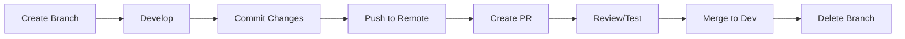

# TinyTorch Git Workflow Standards

## 🎯 Core Principle: Always Work on Feature Branches

**NEVER work directly on main or dev branches.** Every piece of work, no matter how small, starts with creating a new branch.

## 📋 Branch Creation Standards

### When to Create a New Branch
- **Before ANY module enhancement** 
- **Before ANY bug fix**
- **Before ANY documentation update**
- **Before ANY infrastructure change**
- **Before ANY agent-driven development**

### Branch Naming Convention
```bash
# Format: <type>/<description>
# Examples:
feature/enhance-module-04-layers
fix/tensor-import-error
docs/update-educational-patterns
infra/notebook-conversion-workflow
agent/quality-assurance-validation
```

### Branch Types
- `feature/` - New features or module enhancements
- `fix/` - Bug fixes
- `docs/` - Documentation updates
- `infra/` - Infrastructure, CI/CD, build system changes
- `agent/` - Work initiated by specific agents
- `test/` - Testing improvements
- `refactor/` - Code refactoring

## 🔄 Standard Workflow

### 1. Start Work: Create Branch
```bash
# Always start from dev (or main if no dev)
git checkout dev
git pull origin dev

# Create and switch to new branch
git checkout -b feature/enhance-module-04-layers
```

### 2. During Work: Regular Commits
```bash
# Stage changes
git add .

# Commit with meaningful message
git commit -m "Add comprehensive educational scaffolding to layers module

- Enhanced conceptual foundation with 150+ lines
- Added visual diagrams and mathematical explanations
- Implemented TODO/APPROACH/EXAMPLE/HINTS pattern
- Created integration tests with tensor and activations"
```

### 3. Complete Work: Push and PR
```bash
# Push branch to remote
git push -u origin feature/enhance-module-04-layers

# Create Pull Request via GitHub CLI
gh pr create --title "Enhance Module 04 (Layers) with educational patterns" \
  --body "Description of changes..."
```

## 📝 Commit Message Standards

### Format
```
<type>: <subject>

<body>

<footer>
```

### Example
```
feature: Enhance Module 04 (Layers) with comprehensive educational scaffolding

- Added 150+ lines of conceptual foundation
- Implemented visual diagrams for matrix multiplication
- Enhanced Dense layer with production connections
- Created integration tests with previous modules
- Added checkpoint sections for student validation

This completes the foundation layer sequence (modules 01-05) with
consistent educational patterns.

🤖 Generated with [Claude Code](https://claude.ai/code)
Co-Authored-By: Claude <noreply@anthropic.com>
```

## 🚫 Never Do This

### ❌ Bad Practices
```bash
# NEVER commit directly to main
git checkout main
git add .
git commit -m "quick fix"  # NO!

# NEVER work without a branch
vim module.py
git add .
git commit -m "changes"  # NO!

# NEVER use vague commit messages
git commit -m "updates"  # NO!
git commit -m "fixes"    # NO!
```

### ✅ Good Practices
```bash
# ALWAYS create a branch first
git checkout -b fix/tensor-shape-error

# ALWAYS use descriptive commits
git commit -m "Fix tensor shape preservation in arithmetic operations"

# ALWAYS push to feature branch
git push -u origin fix/tensor-shape-error
```

## 🔀 Merging Standards

### Before Merging
- [ ] All tests pass
- [ ] Code reviewed (if team environment)
- [ ] Documentation updated
- [ ] Validation workflow passes
- [ ] No conflicts with target branch

### Merge Process
```bash
# Update your branch with latest dev
git checkout dev
git pull origin dev
git checkout feature/your-branch
git merge dev

# Resolve any conflicts
# Test everything works
# Then merge via PR
```

## 🏷️ Protected Branches

These branches should have protection rules:
- `main` - Production ready code only
- `dev` - Development integration branch
- No direct pushes allowed
- Require PR reviews
- Require status checks to pass

## 📊 Branch Lifecycle



## 🎯 Agent-Specific Standards

When agents create branches:
- **Education Architect**: `agent/education-design-module-XX`
- **Module Developer**: `feature/enhance-module-XX-name`
- **Quality Assurance**: `test/validation-module-XX`
- **Documentation Publisher**: `docs/update-module-XX-docs`
- **DevOps Engineer**: `infra/component-description`

## 🔧 Git Configuration

### Recommended Setup
```bash
# Set up useful aliases
git config --global alias.co checkout
git config --global alias.br branch
git config --global alias.ci commit
git config --global alias.st status

# Set default branch name
git config --global init.defaultBranch main

# Set pull strategy
git config --global pull.rebase false
```

## 📝 Codified Rules

1. **ALWAYS create a new branch before starting ANY work**
2. **NEVER commit directly to main or dev branches**
3. **ALWAYS use descriptive branch names following conventions**
4. **ALWAYS write meaningful commit messages**
5. **ALWAYS test before pushing**
6. **ALWAYS create a PR for code review**
7. **ALWAYS delete branches after merging**
8. **ALWAYS pull latest changes before creating new branches**

This workflow ensures code quality, enables collaboration, maintains history, and prevents conflicts in the TinyTorch project.