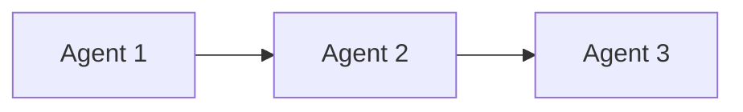

# 🌟 Universal Claude Project Template

## Overview
This template provides a reusable structure for ANY Claude project. Adapt it to your specific needs while maintaining the core organizational principles.

## 📁 Core Structure

```
.claude/
├── README.md              # Your project-specific Claude instructions
├── agents/               # Specialized AI agents for your domain
├── workflows/           # Reusable command sequences
└── guidelines/         # Project standards and practices
```

## 🎯 Universal Slash Commands

These commands work across all project types:

| Command | Purpose | Universal Pattern |
|---------|---------|-------------------|
| `/create [what]` | Create new content/code | Architect → Developer → Reviewer |
| `/fix [issue]` | Fix bugs or problems | Analyzer → Fixer → Tester |
| `/review [target]` | Review and improve | Reviewer → Improver → Validator |
| `/refactor [code]` | Restructure code | Analyzer → Refactorer → Tester |
| `/docs [topic]` | Documentation | Researcher → Writer → Editor |
| `/test [component]` | Testing | Test Designer → Executor → Reporter |
| `/deploy [what]` | Deployment | Validator → Deployer → Monitor |
| `/analyze [subject]` | Analysis | Researcher → Analyzer → Reporter |

## 🤖 Universal Agent Archetypes

### Core Agents (Adapt Names to Your Domain)

1. **Architect/Designer**
   - High-level planning
   - System design
   - Strategy decisions

2. **Developer/Creator**
   - Implementation
   - Building/writing
   - Execution

3. **Reviewer/QA**
   - Quality assurance
   - Testing
   - Validation

4. **Coordinator/PM**
   - Workflow orchestration
   - Timeline management
   - Integration

5. **Researcher/Analyst**
   - Information gathering
   - Analysis
   - Investigation

## 📋 Adapting This Template

### Step 1: Define Your Domain
Replace generic agents with domain-specific ones:
- Web Project → Frontend Dev, Backend Dev, UX Designer
- Data Project → Data Engineer, ML Engineer, Data Analyst
- API Project → API Designer, Backend Dev, Security Reviewer

### Step 2: Create Your Workflows
Define sequences for common tasks:
```markdown
## /create workflow
1. Architect: Design the solution
2. Developer: Implement it
3. Reviewer: Validate quality
4. Coordinator: Integrate and deploy
```

### Step 3: Set Your Guidelines
Document your standards:
- Code style conventions
- Commit message format
- Testing requirements
- Review criteria

## 🚀 Best Practices

### 1. **Agent Single Responsibility**
Each agent should have ONE clear role. Don't create "do-everything" agents.

### 2. **Workflow Quality Gates**
Every workflow should have checkpoints where work can be validated before proceeding.

### 3. **Clear Handoffs**
Define exactly what each agent passes to the next:
- What was completed
- What needs to be done
- Any issues found
- Test results

### 4. **Slash Command Naming**
- Keep them short (max 10 characters)
- Use verbs (`/create`, `/fix`, `/test`)
- Be consistent across projects

### 5. **Documentation First**
Before creating agents or workflows, document:
- What problem does this solve?
- When should it be used?
- What's the expected outcome?

## 💡 Advanced Patterns

### Parallel Workflows
Some tasks can run simultaneously:
```
/analyze → [Research Agent, Data Agent, Security Agent] → Coordinator
```

### Conditional Workflows
Some workflows branch based on results:
```
/deploy → Validator → (if pass) → Deployer
                   ↓
                (if fail) → Fixer → Validator
```

### Recursive Workflows
Some workflows call themselves:
```
/refactor → Analyzer → Refactorer → Tester → (if complex) → /refactor
```

## 📝 CLAUDE.md Template

```markdown
# Claude Instructions for [Your Project]

## 🎯 Quick Commands
[Your slash commands table]

## 🤖 Available Agents
[Your specialized agents]

## 📋 Workflows
See `.claude/workflows/` for detailed sequences

## 🚨 Critical Policies
[Your non-negotiable rules]

## 💡 Project Context
[Brief project description]
```

## 🔄 Workflow File Template

```markdown
# /[command] Workflow

## Purpose
[What this workflow accomplishes]

## When to Use
[Specific triggers or scenarios]

## Sequence


## Agent Responsibilities

### Agent 1
- Task A
- Task B
- Output: [what they produce]

### Agent 2
- Task C
- Task D
- Output: [what they produce]

## Quality Gates
- [ ] Gate 1: [validation criteria]
- [ ] Gate 2: [validation criteria]

## Example Usage
`/command specific request here`
```

## 🎨 Customization Examples

### For Web Projects
- `/component` → UI Designer → Frontend Dev → Accessibility Checker
- `/api` → API Designer → Backend Dev → API Tester
- `/style` → Designer → CSS Dev → Browser Tester

### For Data Projects
- `/pipeline` → Data Architect → Engineer → Validator
- `/model` → ML Designer → ML Engineer → Performance Tester
- `/etl` → Data Analyst → ETL Dev → Data Quality Checker

### For Documentation Projects
- `/guide` → Outliner → Writer → Technical Editor
- `/tutorial` → Instructor Designer → Content Creator → Tester
- `/api-docs` → API Analyzer → Doc Writer → Example Creator

## ⚡ Quick Start

1. Copy this template to your `.claude/` directory
2. Rename agents to match your domain
3. Define your top 5 workflows
4. Create your slash commands
5. Document critical policies
6. Start using `/commands`!

## 🚨 Remember

- **Agents are reusable** - Design them to work across multiple workflows
- **Workflows are repeatable** - Make them deterministic and predictable
- **Commands are memorable** - Keep them short and verb-based
- **Documentation is essential** - Future you will thank current you

This template scales from solo projects to large teams. Start simple, expand as needed.