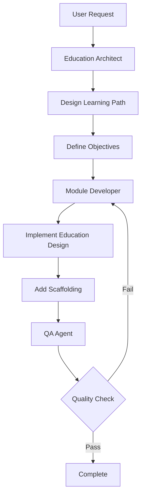

# Educational Content Workflow

## Command
`/education [request]`

## Purpose
Design and implement educational improvements to modules and learning materials.

## Workflow Sequence


## Agent Responsibilities

### 1. Education Architect
**Inputs:** Educational improvement request  
**Outputs:** Learning design specification

**Tasks:**
- Analyze learning objectives
- Design capability progression
- Define assessment criteria
- Create scaffolding strategy
- Specify NBGrader integration

**Deliverables:**
- Learning objective document
- Capability progression map
- Assessment strategy
- Scaffolding requirements

### 2. Module Developer
**Inputs:** Educational design specification  
**Outputs:** Implemented educational content

**Tasks:**
- Implement learning scaffolding
- Add educational comments
- Create micro-reflections
- Implement assessments
- Add NBGrader metadata

### 3. QA Agent
**Inputs:** Educational implementation  
**Outputs:** Validation report

**Tasks:**
- Verify learning objectives met
- Test assessment functionality
- Validate NBGrader integration
- Check scaffolding effectiveness

## Educational Components

### Learning Scaffolding
- Progressive difficulty
- Immediate feedback
- Guided exercises
- Concept reinforcement

### Assessment Types
- Computational questions
- Micro-reflections
- Synthesis questions
- Performance analysis

### NBGrader Integration
- Autograded cells
- Manual review cells
- Hidden tests
- Point allocation

## Quality Checks
- [ ] Learning objectives clear
- [ ] Progressive difficulty implemented
- [ ] Assessments functional
- [ ] NBGrader ready
- [ ] Immediate feedback works

## Common Use Cases
- Improving module pedagogy
- Adding assessments
- Creating learning paths
- Enhancing scaffolding
- Designing exercises

## Example Usage
```
User: /education improve the autograd module learning experience
```

**Result:** Architect designs → Developer implements → QA validates