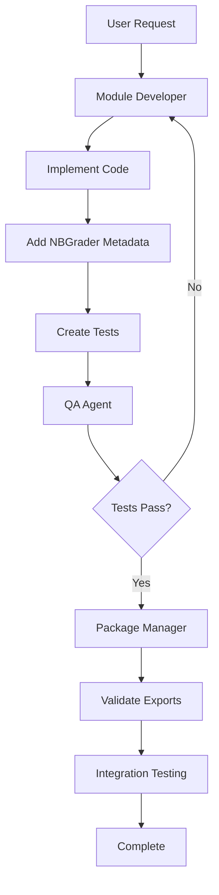

# Module Development Workflow

## Command
`/module [request]`

## Purpose
Implement, update, or fix TinyTorch modules with comprehensive testing and integration.

## Workflow Sequence


## Agent Responsibilities

### 1. Module Developer
**Inputs:** Module requirements or fixes needed  
**Outputs:** Implemented module with tests

**Tasks:**
- Implement code in `modules/source/XX_name/name_dev.py`
- Add NBGrader metadata for grading
- Include systems analysis (memory/performance)
- Create immediate tests after implementations
- Add export directives (#| default_exp)

**Deliverables:**
- Complete module implementation
- Unit tests for each component
- Systems performance analysis
- NBGrader integration

### 2. QA Agent
**Inputs:** Module implementation  
**Outputs:** Test results and validation

**Tasks:**
- Run all module tests
- Verify imports work correctly
- Check systems analysis present
- Validate NBGrader metadata
- Test performance characteristics

**Quality Gates:**
- All tests must pass
- No import errors
- Systems analysis included
- Memory profiling works

### 3. Package Manager
**Inputs:** Tested module  
**Outputs:** Integrated package

**Tasks:**
- Validate module exports correctly
- Check integration with other modules
- Run integration tests
- Ensure package builds
- Verify no conflicts

## Quality Checks
- [ ] All tests passing
- [ ] Exports work correctly
- [ ] No integration conflicts
- [ ] Systems analysis included
- [ ] NBGrader ready

## Common Use Cases
- Implementing new modules
- Fixing module bugs
- Adding module features
- Improving performance
- Adding tests

## Example Usage
```
User: /module fix the autograd backward pass
```

**Result:** Developer fixes → QA tests → Package integrates