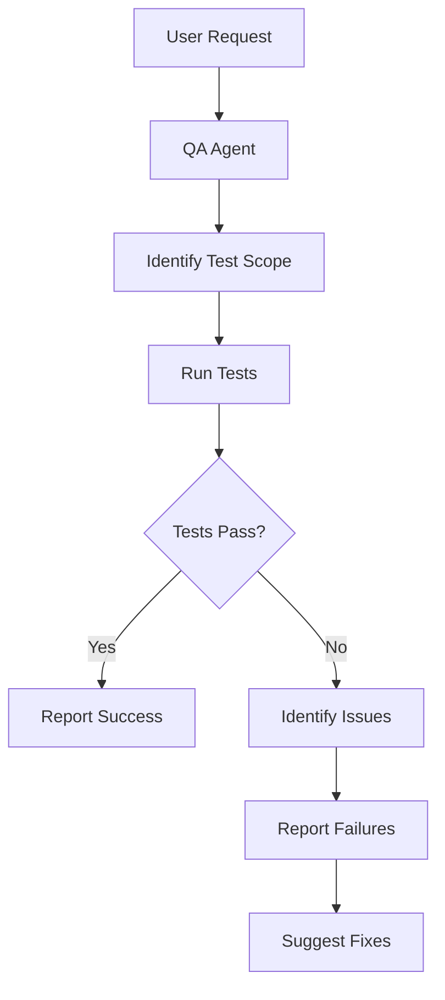

# Testing Workflow

## Command
`/test [target]`

## Purpose
Comprehensive testing of modules, checkpoints, or entire system.

## Workflow Sequence


## Agent Responsibilities

### 1. QA Agent
**Inputs:** Test target specification  
**Outputs:** Comprehensive test report

**Tasks:**
- Determine test scope from request
- Execute appropriate test suite
- Validate functionality
- Check performance metrics
- Generate detailed report

**Test Types:**
- Unit tests (individual functions)
- Integration tests (module interactions)
- Checkpoint tests (capability validation)
- Performance tests (memory/speed)
- System tests (end-to-end)

## Test Scopes

### Module Testing
```bash
tito test --module tensor
tito test --module autograd --verbose
```

### Checkpoint Testing
```bash
tito checkpoint test 01
tito checkpoint test --all
```

### Integration Testing
```bash
tito test --integration
tito test --package
```

## Quality Checks
- [ ] All specified tests run
- [ ] Clear pass/fail status
- [ ] Detailed error messages
- [ ] Performance metrics included
- [ ] Actionable recommendations

## Common Use Cases
- Validating new implementations
- Regression testing
- Performance validation
- Checkpoint verification
- Pre-commit testing

## Example Usage
```
User: /test all checkpoint capabilities
```

**Result:** QA runs all checkpoint tests → Reports results