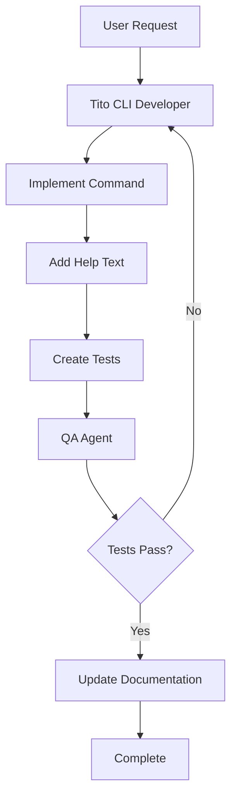

# TITO CLI Development Workflow

## Command
`/tito [request]`

## Purpose
Add, update, or fix TITO CLI commands and functionality.

## Workflow Sequence


## Agent Responsibilities

### 1. Tito CLI Developer
**Inputs:** CLI feature requirements  
**Outputs:** Implemented CLI functionality

**Tasks:**
- Implement new commands in `tito/commands/`
- Add command to main CLI interface
- Create comprehensive help text
- Implement error handling
- Add progress indicators (Rich)

**Implementation Requirements:**
- Follow Click framework patterns
- Use Rich for visual output
- Implement --verbose flags
- Add proper error messages
- Include progress tracking

### 2. QA Agent
**Inputs:** CLI implementation  
**Outputs:** Validation results

**Tasks:**
- Test command execution
- Verify help text accuracy
- Check error handling
- Validate output formatting
- Test edge cases

## Command Categories

### Module Commands
- `tito module work`
- `tito module complete`
- `tito module status`

### Checkpoint Commands
- `tito checkpoint status`
- `tito checkpoint test`
- `tito checkpoint timeline`

### System Commands
- `tito system doctor`
- `tito system info`

### NBGrader Commands
- `tito nbgrader init`
- `tito nbgrader generate`
- `tito nbgrader autograde`

## Quality Checks
- [ ] Command works as expected
- [ ] Help text is clear
- [ ] Error messages helpful
- [ ] Progress indicators work
- [ ] Documentation updated

## Common Use Cases
- Adding new CLI commands
- Improving command output
- Adding visual indicators
- Fixing command bugs
- Enhancing user experience

## Example Usage
```
User: /tito add a command to show module dependencies
```

**Result:** CLI Developer implements → QA validates → Docs updated