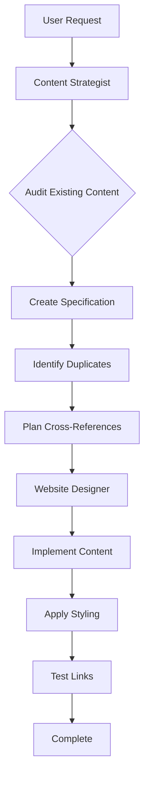

# Website Update Workflow

## Command
`/website [request]`

## Purpose
Update, add, or modify website content while maintaining consistency and preventing duplication.

## Workflow Sequence


## Agent Responsibilities

### 1. Website Content Strategist
**Inputs:** User request for website changes  
**Outputs:** Content specification document

**Tasks:**
- Audit ALL existing pages for duplicate content
- Determine canonical location for new content
- Create detailed content specification
- Identify cross-references needed
- Specify what to remove (if duplicates exist)

**Deliverable Format:**
```markdown
## Content Implementation Plan
### Page: [filename.md]
**Purpose**: [ONE clear unique purpose]
**Content to Add**: [Detailed sections]
**Content to Remove**: [Duplicates to delete]
**Cross-References**: [Links to related pages]
**Implementation Notes**: [Styling requirements]
```

### 2. Website Designer
**Inputs:** Content specification from strategist  
**Outputs:** Implemented website changes

**Tasks:**
- Implement content exactly as specified
- Apply consistent HTML/CSS styling
- Ensure responsive design
- Test all cross-references
- Verify no duplicates created

## Quality Checks
- [ ] No duplicate content created
- [ ] All cross-references work
- [ ] Consistent styling applied
- [ ] Mobile responsive
- [ ] Follows canonical locations

## Common Use Cases
- Adding new documentation pages
- Updating existing content
- Fixing broken links
- Improving user experience
- Adding navigation elements

## Example Usage
```
User: /website add a debugging guide for students
```

**Result:** Content Strategist creates specification → Designer implements