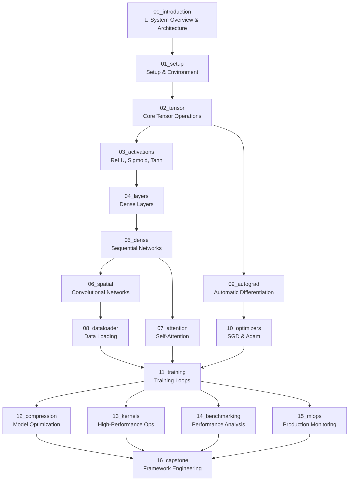

# Tiny🔥Torch 

**Build your own ML framework. Start small. Go deep.**


[](https://github.com/MLSysBook/TinyTorch)
[](https://python.org)
[](https://mybinder.org/v2/gh/MLSysBook/TinyTorch/main)
[](https://mlsysbook.github.io/TinyTorch/)

📚 **[Read the Interactive Course →](https://mlsysbook.github.io/TinyTorch/)**

---

## 🏗️ **The Big Picture: Why Build from Scratch?**

**Most ML education teaches you to _use_ frameworks.** TinyTorch teaches you to _build_ them.

```python
Traditional ML Course:          TinyTorch Approach:
├── import torch               ├── class Tensor:
├── model = nn.Linear(10, 1)   │     def __add__(self, other): ...
├── loss = nn.MSELoss()        │     def backward(self): ...
└── optimizer.step()           ├── class Linear:
                               │     def forward(self, x):
                               │       return x @ self.weight + self.bias
                               ├── def mse_loss(pred, target):
                               │     return ((pred - target) ** 2).mean()
                               ├── class SGD:
                               │     def step(self):
                               └──     param.data -= lr * param.grad

Go from "How does this work?" 🤷 to "I implemented every line!" 💪
```

**Result:** You become the person others come to when they need to understand "how PyTorch actually works under the hood."

---

## 🌟 **What Makes TinyTorch Different**

### **🔬 Build-First Philosophy**
- **No black boxes**: Implement every component from scratch
- **Immediate ownership**: Use YOUR code in real neural networks
- **Deep understanding**: Know exactly how each piece works

### **🚀 Real Production Skills**
- **Professional workflow**: Development with `tito` CLI, automated testing
- **Real datasets**: Train on CIFAR-10, not toy data
- **Production patterns**: MLOps, monitoring, optimization from day one

### **🎯 Progressive Mastery** 
- **Start simple**: Implement `hello_world()` function
- **Build systematically**: Each module enables the next
- **End powerful**: Deploy production ML systems with monitoring

### **⚡ Instant Feedback**
- **Code works immediately**: No waiting to see results
- **Visual progress**: Success indicators and system integration
- **"Aha moments"**: Watch your `ReLU` power real neural networks

### **📊 NEW: Visual System Architecture**
- **Interactive dependency graphs**: See how all 17 modules connect
- **Learning roadmap visualization**: Optimal path through the system
- **Architecture diagrams**: Complete framework overview
- **Automated analysis**: Live system statistics and component mapping

---

## 🎯 What You'll Build

* **One Complete ML Framework** — Not 17 separate exercises, but integrated components building into your own PyTorch-style toolkit
* **Fully Functional System** — Every piece connects: your tensors power your layers, your autograd enables your optimizers, your framework trains real networks
* **Real Applications** — Train neural networks on CIFAR-10 using 100% your own code, no PyTorch imports
* **Production-Ready Skills** — Complete ML lifecycle: data loading, training, optimization, deployment, monitoring
* **Deep Systems Understanding** — Know exactly how every component works and integrates because you built it all

---

## 🚀 Quick Start (2 minutes)

### 📊 **First Time? Start with the System Overview**

```bash
git clone https://github.com/mlsysbook/TinyTorch.git
cd TinyTorch
pip install -r requirements.txt           # Install all dependencies (numpy, jupyter, pytest, etc.)
pip install -e .                          # Install TinyTorch package in editable mode
tito system doctor                         # Verify your setup

# 🎯 NEW: Interactive System Architecture Overview
cd modules/source/00_introduction
jupyter lab introduction_dev.py           # Explore the complete TinyTorch system visually!
```

### 🧑‍🎓 **Ready to Build? Start Here**

```bash
# After exploring the system overview, start building:
cd modules/source/01_setup
jupyter lab setup_dev.py                  # Launch your first implementation module
```

### 👩‍🏫 **Instructors**

```bash
# System check
tito system info
tito system doctor

# Module workflow
tito export 01_setup
tito test 01_setup
tito nbdev build                          # Update package
```

---

## 📁 **Repository Structure**

```
TinyTorch/
├── modules/source/           # 17 educational modules
│   ├── 00_introduction/     # 🎯 NEW: Visual system overview & architecture
│   │   ├── module.yaml      # Module metadata  
│   │   ├── README.md        # Getting started guide
│   │   └── introduction_dev.py  # Interactive visualizations & dependency analysis
│   ├── 01_setup/            # Development environment setup
│   │   ├── module.yaml      # Module metadata
│   │   ├── README.md        # Learning objectives and guide
│   │   └── setup_dev.py     # Implementation file
│   ├── 02_tensor/           # N-dimensional arrays
│   │   ├── module.yaml
│   │   ├── README.md
│   │   └── tensor_dev.py
│   ├── 03_activations/      # Neural network activation functions
│   ├── 04_layers/           # Dense layers and transformations
│   ├── 05_dense/            # Sequential networks and MLPs
│   ├── 06_spatial/          # Convolutional neural networks
│   ├── 07_attention/        # Self-attention and transformer components
│   ├── 08_dataloader/       # Data loading and preprocessing
│   ├── 09_autograd/         # Automatic differentiation
│   ├── 10_optimizers/       # SGD, Adam, learning rate scheduling
│   ├── 11_training/         # Training loops and validation
│   ├── 12_compression/      # Model optimization and compression
│   ├── 13_kernels/          # High-performance operations
│   ├── 14_benchmarking/     # Performance analysis and profiling
│   ├── 15_mlops/            # Production monitoring and deployment
│   └── 16_capstone/         # Systems engineering capstone project
├── tinytorch/               # Your built framework package
│   ├── core/                # Core implementations (exported from modules)
│   │   ├── tensor.py        # Generated from 02_tensor
│   │   ├── activations.py   # Generated from 03_activations
│   │   ├── layers.py        # Generated from 04_layers
│   │   ├── dense.py         # Generated from 05_dense
│   │   ├── spatial.py       # Generated from 06_spatial
│   │   ├── attention.py     # Generated from 07_attention
│   │   └── ...              # All your implementations
│   └── utils/               # Shared utilities and tools
├── book/                    # Interactive course website
│   ├── _config.yml          # Jupyter Book configuration
│   ├── intro.md             # Course introduction
│   └── chapters/            # Generated from module READMEs
├── tito/                    # CLI tool for development workflow
│   ├── commands/            # Student and instructor commands
│   └── tools/               # Testing and build automation
└── tests/                   # Integration tests
```

**How It Works:**
0. **🎯 Start with Overview** - Explore `00_introduction` for visual system architecture and dependencies
1. **Develop in `modules/source/`** - Each module has a `*_dev.py` file where you implement components
2. **Export to `tinytorch/`** - Use `tito export` to build your implementations into a real Python package
3. **Use your framework** - Import and use your own code: `from tinytorch.core.tensor import Tensor`
4. **Test everything** - Run `tito test` to verify your implementations work correctly
5. **Build iteratively** - Each module builds on previous ones, creating a complete ML framework

---

## 📚 Complete Course: 17 Modules

**Difficulty Progression:** 📊 Overview → ⭐ Beginner → ⭐⭐ Intermediate → ⭐⭐⭐ Advanced → ⭐⭐⭐⭐ Expert → ⭐⭐⭐⭐⭐🥷 Capstone

### **📊 System Overview** (Module 00)
* **🎯 00_introduction**: Interactive system architecture, dependency visualization, and learning roadmap

### **🏗️ Foundations** (Modules 01-05)
* **01_setup**: Development environment and CLI tools
* **02_tensor**: N-dimensional arrays and tensor operations  
* **03_activations**: ReLU, Sigmoid, Tanh, Softmax functions
* **04_layers**: Dense layers and matrix operations
* **05_dense**: Sequential networks and MLPs

### **🧠 Deep Learning** (Modules 06-10)
* **06_spatial**: Convolutional neural networks and image processing
* **07_attention**: Self-attention and transformer components
* **08_dataloader**: Data loading, batching, and preprocessing
* **09_autograd**: Automatic differentiation and backpropagation  
* **10_optimizers**: SGD, Adam, and learning rate scheduling

### **⚡ Systems & Production** (Modules 11-15)
* **11_training**: Training loops, metrics, and validation
* **12_compression**: Model pruning, quantization, and distillation
* **13_kernels**: Performance optimization and custom operations
* **14_benchmarking**: Profiling, testing, and performance analysis
* **15_mlops**: Monitoring, deployment, and production systems

### **🎓 Capstone Project** (Module 16)
* **16_capstone**: Advanced framework engineering specialization tracks

**Status**: All 17 modules complete with inline tests and educational content

---

## 🔗 **Complete System Integration**

**This isn't 17 isolated assignments.** Every component you build integrates into one cohesive, fully functional ML framework:

**🎯 NEW: Explore the full system architecture visually in Module 00 before diving into implementation!**



### **🎯 How It All Connects**

**Foundation (01-05):** Build your core data structures and basic operations  
**Deep Learning (06-10):** Add neural networks and automatic differentiation  
**Production (11-15):** Scale to real applications with training and production systems  
**Mastery (16):** Optimize and extend your complete framework

**The Result:** A complete, working ML framework built entirely by you, capable of:
- ✅ Training CNNs on CIFAR-10 with 90%+ accuracy
- ✅ Implementing modern optimizers (Adam, learning rate scheduling)  
- ✅ Deploying compressed models with 75% size reduction
- ✅ Production monitoring with comprehensive metrics

### **🚀 Capstone: Optimize Your Framework**

After completing the 15 core modules, you have a **complete ML framework**. The final challenge: make it better through systems engineering.

**Choose Your Focus:**
- ⚡ **Performance Engineering**: GPU kernels, vectorization, memory-efficient operations
- 🧠 **Algorithm Extensions**: Transformer layers, BatchNorm, Dropout, advanced optimizers  
- 🔧 **Systems Optimization**: Multi-GPU training, distributed computing, memory profiling
- 📊 **Benchmarking Analysis**: Compare your framework to PyTorch, identify bottlenecks
- 🛠️ **Developer Tools**: Better debugging, visualization, error messages, testing

**The Constraint:** No `import torch` allowed. Build on **your TinyTorch implementation**. This demonstrates true mastery of ML systems engineering and optimization.

---

## 🧠 Pedagogical Framework: Build → Use → Reflect

### **Example: How You'll Master Activation Functions**

**🔧 Build:** Implement ReLU from scratch
```python
def relu(x):
    # YOU implement this function
    return ???  # What should this be?
```

**🚀 Use:** Immediately use your own code
```python
from tinytorch.core.activations import ReLU  # YOUR implementation!
layer = ReLU()
output = layer.forward(input_tensor)  # Your code working!
```

**💡 Reflect:** See it working in real networks
```python
# Your ReLU is now part of a real neural network
model = Sequential([
    Dense(784, 128),
    ReLU(),           # <-- Your implementation
    Dense(128, 10)
])
```

**This pattern repeats for every component** — you build it, use it immediately, then see how it fits into larger systems.

---

## 🎓 Teaching Philosophy

### **No Black Boxes**
* Build every component from scratch
* Understand performance trade-offs  
* See how engineering decisions impact ML outcomes

### **Production-Ready Thinking**
* Use real datasets (CIFAR-10, MNIST)
* Implement proper testing and benchmarking
* Learn MLOps and system design principles

### **Iterative Mastery**
* Each module builds on previous work
* Immediate feedback through inline testing
* Progressive complexity with solid foundations

---

## 📖 Documentation

### **Interactive Jupyter Book**
- **Live Site**: https://mlsysbook.github.io/TinyTorch/
- **Auto-updated** from source code on every release
- **Complete course content** with executable examples
- **Real implementation details** with solution code

### **Development Workflow**
- **`dev` branch**: Active development and experiments  
- **`main` branch**: Stable releases that trigger documentation deployment
- **Inline testing**: Tests embedded directly in source modules
- **Continuous integration**: Automatic building and deployment

---

## 🛠️ Development Workflow

### **Module Development**
```bash
# Work on dev branch
git checkout dev

# Edit source modules  
cd modules/source/02_tensor
jupyter lab tensor_dev.py

# Export to package
tito export 02_tensor

# Test your implementation
tito test 02_tensor

# Build complete package
tito nbdev build
```

### **Release Process**
```bash
# Ready for release
git checkout main
git merge dev
git push origin main        # Triggers documentation deployment
```

---

## 📁 Project Structure

```
TinyTorch/
├── modules/source/XX/               # 16 source modules with inline tests
├── tinytorch/core/                  # Your exported ML framework
├── tito/                           # CLI and course management tools
├── book/                           # Jupyter Book source and config
├── tests/                          # Integration tests
└── docs/                           # Development guides and workflows
```

---

## 🧪 Tech Stack

* **Python 3.8+** — Modern Python with type hints
* **NumPy** — Numerical foundations  
* **Jupyter Lab** — Interactive development
* **Rich** — Beautiful CLI output
* **NBDev** — Literate programming and packaging
* **Jupyter Book** — Interactive documentation
* **GitHub Actions** — Continuous integration and deployment

---

## ✅ Verified Learning Outcomes

Students who complete TinyTorch can:

✅ **Build complete neural networks** from tensors to training loops  
✅ **Implement modern ML algorithms** (Adam, dropout, batch norm)  
✅ **Optimize performance** with profiling and custom kernels  
✅ **Deploy production systems** with monitoring and MLOps  
✅ **Debug and test** ML systems with proper engineering practices  
✅ **Understand trade-offs** between accuracy, speed, and resources  

---

## 🏃‍♀️ Getting Started

### **Option 1: Interactive Course**
👉 **[Start Learning Now](https://mlsysbook.github.io/TinyTorch/)** — Complete course in your browser

### **Option 2: Local Development**
```bash
git clone https://github.com/mlsysbook/TinyTorch.git
cd TinyTorch
pip install -r requirements.txt           # Install all dependencies (numpy, jupyter, pytest, etc.)
pip install -e .                          # Install TinyTorch package in editable mode  
tito system doctor
cd modules/source/01_setup
jupyter lab setup_dev.py
```

### **Option 3: Instructor Setup**
```bash
# Clone and verify system
git clone https://github.com/mlsysbook/TinyTorch.git
cd TinyTorch
tito system info

# Test module workflow
tito export 01_setup && tito test 01_setup
```

---

**🔥 Ready to build your ML framework? Start with TinyTorch and understand every layer. _Start Small. Go Deep._**

---

## ❓ **Frequently Asked Questions**

<details>
<summary><strong>🚀 "Why not just use PyTorch/TensorFlow? This seems like reinventing the wheel."</strong></summary>

<br>

> **You're right - for production, use PyTorch!** But consider:
>
> **🤔 Deep Understanding Questions:**
> - **Do you understand what `loss.backward()` actually does?** Most engineers don't.
> - **Can you debug when gradients vanish?** You'll know why and how to fix it.  
> - **Could you optimize a custom operation?** You'll have built the primitives.
>
> **💡 The Learning Analogy:**  
> Think of it like this: Pilots learn in small planes before flying 747s. You're learning the fundamentals that make you a **better PyTorch engineer**.

---
</details>

<details>
<summary><strong>⚡ "How is this different from online tutorials that build neural networks?"</strong></summary>

<br>

> **Most tutorials focus on isolated components** - a Colab here, a notebook there. TinyTorch builds a **fully integrated system**.
>
> **🏗️ Systems Engineering Analogy:**  
> Think of building a **compiler** or **operating system**. You don't just implement a lexer or a scheduler - you build how **every component works together**. Each piece must integrate seamlessly with the whole.
>
> **📊 Component vs. System Approach:**
> ```python
> Component Approach:          Systems Approach (TinyTorch):
> ├── Build a neural network   ├── Build a complete ML framework
> ├── Jupyter notebook demos   ├── Full Python package with CLI
> ├── Isolated examples        ├── Integrated: tensors → layers → training
> └── "Here's how ReLU works"  ├── Production patterns: testing, profiling
>                             └── "Here's how EVERYTHING connects"
> ```
>
> **🎯 Key Insight:**  
> You learn **systems engineering**, not just individual algorithms. Like understanding how every part of a compiler interacts to turn code into executable programs.

---
</details>

<details>
<summary><strong>💡 "Can't I just read papers/books instead of implementing?"</strong></summary>

<br>

> **📚 Reading vs. 🔧 Building:**
> ```
> Reading about neural networks:     Building neural networks:
> ├── "I understand the theory"      ├── "Why are my gradients exploding?"
> ├── "Backprop makes sense"         ├── "Oh, that's why we need gradient clipping"
> ├── "Adam is better than SGD"      ├── "Now I see when each optimizer works"
> └── Theoretical knowledge          └── Deep intuitive understanding
> ```
>
> **🌟 The Reality Check:**  
> Implementation **forces you to confront reality** - edge cases, numerical stability, memory management, performance trade-offs that papers gloss over.

---
</details>

<details>
<summary><strong>🤔 "Isn't everything a Transformer now? Why learn old architectures?"</strong></summary>

<br>

> **Great question!** Transformers are indeed dominant, but they're built on the same foundations you'll implement:
>
> **🏗️ Transformer Building Blocks You'll Build:**
> - **Attention is just matrix operations** - which you'll build from tensors
> - **LayerNorm uses your activations and layers** 
> - **Adam optimizer powers Transformer training** - you'll implement it
> - **Multi-head attention = your Linear layers + reshaping** 
>
> **🎯 The Strategic Reality:**  
> Understanding foundations makes you the engineer who can **optimize Transformers**, not just use them. Plus, CNNs still power computer vision, RNNs drive real-time systems, and new architectures emerge constantly.

---
</details>

<details>
<summary><strong>🎓 "I'm already good at ML. Is this too basic for me?"</strong></summary>

<br>

> **🧪 Challenge Test - Can You:**
> - **Implement Adam optimizer from the paper?** (Not just use `torch.optim.Adam`)
> - **Explain why ReLU causes dying neurons** and how to fix it?
> - **Debug a 50% accuracy drop** after model deployment?
>
> **💪 Why Advanced Engineers Love TinyTorch:**  
> It fills the **"implementation gap"** that most ML education skips. You'll go from understanding concepts to implementing production systems.

---
</details>

<details>
<summary><strong>🧪 "Is this academic or practical?"</strong></summary>

<br>

> **Both!** TinyTorch bridges academic understanding with engineering reality:
>
> **🎓 Academic Rigor:**
> - Mathematical foundations implemented correctly
> - Proper testing and validation methodologies
> - Research-quality implementations you can trust
>
> **⚙️ Engineering Practicality:**
> - Production-style code organization and CLI tools
> - Performance considerations and optimization techniques
> - Real datasets, realistic scale, professional development workflow

---
</details>

<details>
<summary><strong>⏰ "How much time does this take?"</strong></summary>

<br>

> **📊 Time Investment:** ~40-60 hours for complete framework
>
> **🎯 Flexible Learning Paths:**
> - **Quick exploration:** 1-2 modules to understand the approach
> - **Focused learning:** Core modules (01-10) for solid foundations  
> - **Complete mastery:** All 16 modules for full framework expertise
>
> **✨ Self-Paced Design:**  
> Each module is self-contained, so you can stop and start as needed.

---
</details>

<details>
<summary><strong>🔄 "What if I get stuck or confused?"</strong></summary>

<br>

> **🛡️ Built-in Support System:**
> - **Progressive scaffolding:** Each step builds on the previous, with guided implementations
> - **Comprehensive testing:** 200+ tests ensure your code works correctly
> - **Rich documentation:** Visual explanations, real-world context, debugging tips
> - **Professional error messages:** Helpful feedback when things go wrong
> - **Modular design:** Skip ahead or go back without breaking your progress
>
> **💡 Learning Philosophy:**  
> The course is designed to **guide you through complexity**, not leave you struggling alone.

---
</details>

<details>
<summary><strong>🚀 "What can I build after completing TinyTorch?"</strong></summary>

<br>

> **🏗️ Your Framework Becomes the Foundation For:**
> - **Research projects:** Implement cutting-edge papers on solid foundations
> - **Specialized systems:** Computer vision, NLP, robotics applications
> - **Performance engineering:** GPU kernels, distributed training, quantization
> - **Custom architectures:** New layer types, novel optimizers, experimental designs
>
> **🎯 Ultimate Skill Unlock:**  
> You'll have the implementation skills to **turn any ML paper into working code**.

---
</details>
