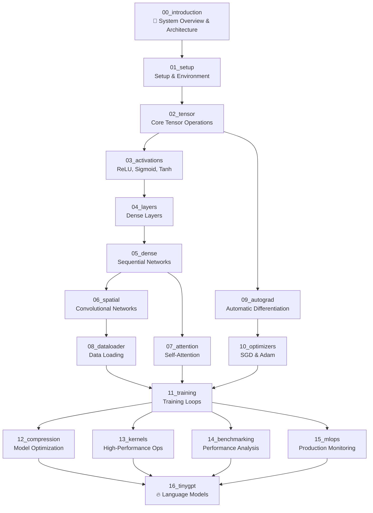

# Tiny🔥Torch 

**Build ML Systems From First Principles. From Computer Vision to Language Models.**


[](https://github.com/MLSysBook/TinyTorch)
[](https://python.org)
[](https://mybinder.org/v2/gh/MLSysBook/TinyTorch/main)
[](https://mlsysbook.github.io/TinyTorch/)

📚 **[Read the Interactive Course →](https://mlsysbook.github.io/TinyTorch/)**

---

## ✨ **New in v0.1**

### **🎯 Interactive ML Systems Learning**
- **Interactive Questions**: Write 150-300 word reflections on ML systems design
- **NBGrader Integration**: Automated assessment with instructor feedback
- **Checkpoint System**: Track your capability progression through 16 checkpoints
- **TinyGPT Module**: Build transformers showing 70% framework component reuse

### **🛠️ Simplified Instructor Tools**
- **`tito grade`**: Complete grading workflow wrapped in simple CLI commands
- **Module Management**: Export, test, and validate all modules with one command
- **Progress Tracking**: Visual checkpoint timeline showing student achievements

---

## 🔬 **Why Build Your Own ML Framework?**

**Most ML courses teach you to use frameworks. TinyTorch teaches you to understand them through systems engineering.**

```python
Algorithm-focused Course:       Systems-focused Course (TinyTorch):
├── import torch               ├── Memory analysis: Adam = 3× parameters
├── model.fit(X, y)           ├── Cache efficiency: Why convolution ordering matters
├── accuracy = 0.95           ├── Gradient bottlenecks: O(N²) attention scaling  
└── "It works!" 🎉           ├── Production patterns: Checkpointing, monitoring
                               ├── Hardware implications: Vectorization, bandwidth
                               └── "I understand the entire system!" 💡
```

**You become the ML engineer who can:**
- Debug performance bottlenecks in production systems
- Optimize memory usage for large-scale deployments  
- Design custom operations for novel architectures
- Understand exactly why certain ML engineering decisions were made

---

## 🎯 **Your Learning Path: ML Systems Engineering**

### **🔬 Phase 1: Core Systems (Modules 1-5)**
- **Memory management**: How tensors use RAM, when copies happen
- **Compute patterns**: Understanding operation complexity O(N²) vs O(N)
- **Data structures**: Why certain tensor layouts enable vectorization
- **Performance foundations**: Cache efficiency, memory bandwidth

### **🧠 Phase 2: ML Systems Architecture (Modules 6-10)**
- **Scaling analysis**: Why attention is O(N²) and how to handle it
- **Memory profiling**: Adam optimizer uses 3× parameter memory - why?
- **Computational graphs**: Memory vs speed tradeoffs in autograd
- **Production patterns**: Gradient checkpointing, mixed precision

### **⚡ Phase 3: Production Engineering (Modules 11-15)**
- **Training systems**: Distributed computing, fault tolerance
- **Optimization techniques**: Quantization, pruning, distillation
- **Hardware acceleration**: Custom kernels, GPU utilization
- **MLOps pipelines**: Monitoring, deployment, A/B testing

### **🚀 Phase 4: Language Models (Module 16 - TinyGPT)**
- **Framework generalization**: Extend vision framework to language models
- **Transformer architecture**: Multi-head attention, autoregressive generation
- **Component reuse**: 95% framework reuse from vision to language
- **ML Systems mastery**: Understand unified mathematical foundations

### **💡 Systems Thinking Through Implementation**
**Every module teaches systems principles through building:**

- **Module 2 (Tensors)**: Learn memory layout by implementing array operations
- **Module 6 (Spatial)**: Understand cache performance through convolution
- **Module 7 (Attention)**: Experience O(N²) scaling by building attention
- **Module 9 (Autograd)**: See memory/compute tradeoffs in gradient computation
- **Module 10 (Optimizers)**: Profile memory usage patterns in Adam vs SGD
- **Module 13 (Kernels)**: Optimize operations for hardware characteristics

**Result**: You don't just know ML algorithms - you understand ML _systems_.

---

## 🏗️ What You'll Build

**A Complete ML Systems Framework** — Understanding through implementation:

### **🔧 Core Systems Engineering**
* **Memory-efficient tensor operations** with performance profiling
* **Computational graph system** with automatic differentiation
* **Training infrastructure** with checkpointing and fault tolerance
* **Production monitoring** with performance bottleneck identification

### **📊 Performance Analysis & Optimization**  
* **Memory profiling tools**: Understand exactly where your RAM goes
* **Compute optimization**: Custom kernels, vectorization patterns
* **Scaling analysis**: When operations become bottlenecks
* **Hardware utilization**: Cache-friendly algorithms and memory patterns

### **🚀 Real-World ML Systems**
* **Train CNNs on CIFAR-10** — Achieve 75%+ accuracy with your own code
* **Deploy production models** — Complete MLOps pipeline with monitoring
* **Handle large-scale data** — Efficient DataLoader with memory management
* **Build language models** — Complete TinyGPT with character-level generation

---

## 🚀 Quick Start (2 minutes)

### 📊 **Step 1: Setup & System Check**

```bash
git clone https://github.com/mlsysbook/TinyTorch.git
cd TinyTorch
pip install -r requirements.txt           # Install all dependencies (numpy, jupyter, pytest, etc.)
pip install -e .                          # Install TinyTorch package in editable mode
tito system doctor                         # Verify your setup
```

### 🎯 **Step 2: Start with Module 0 - Introduction**

```bash
# Begin your TinyTorch journey with the system overview:
cd modules/source/00_introduction
jupyter lab introduction_dev.py           # Interactive visualizations of the entire system!

# What you'll explore:
# - Complete system architecture visualization
# - Module dependency graphs
# - Optimal learning path through 17 modules
# - Component relationships and complexity analysis
```

### 🧑‍🎓 **Step 3: Continue to Module 1 - Setup**

```bash
# After understanding the system, start building:
cd ../01_setup
jupyter lab setup_dev.py                  # Your first implementation module

# Complete the module with automatic testing:
tito module complete 01_setup             # Exports to package AND tests capabilities
```

### 🎯 **Step 4: Track Your Progress with Checkpoints**

```bash
# See your capability progression:
tito checkpoint status                     # Current progress overview
tito checkpoint timeline --horizontal      # Visual progress timeline
tito checkpoint test 00                    # Test environment checkpoint

# What you'll see:
# ✅ 00: Environment - "Can I configure my TinyTorch development environment?"
# 🎯 01: Foundation - "Can I create and manipulate the building blocks of ML?"
# ⏳ 02: Intelligence - "Can I add nonlinearity - the key to neural network intelligence?"
```

### 👩‍🏫 **Instructors**

```bash
# System check
tito system info
tito system doctor

# Module workflow with checkpoint integration
tito module complete 01_setup            # Export + test capability
tito checkpoint status --detailed        # Student progress overview
tito checkpoint test 01                   # Validate specific checkpoint

# Traditional workflow (still available)
tito export 01_setup
tito test 01_setup
tito nbdev build                          # Update package
```

---

## 🔗 **Connection to ML Systems Research**

**Optional Enhancement**: TinyTorch concepts align with the Machine Learning Systems book:

- **Chapter 5 (Data Engineering)**: Your DataLoader implementation (Module 8)
- **Chapter 6 (Feature Engineering)**: Tensor operations and preprocessing (Module 2)
- **Chapter 7 (Model Development)**: Layer architectures you build (Modules 4-7)
- **Chapter 8 (Model Training)**: Training loops and optimization (Modules 10-11)
- **Chapter 9 (Model Deployment)**: MLOps and production systems (Module 15)
- **Chapter 11 (Continual Learning)**: Advanced techniques (Module 12)

**TinyTorch provides the implementation foundation for understanding these concepts deeply.**

---

## 🚀 **Your Learning Journey: Vision to Language**

**TinyTorch demonstrates that the same mathematical foundations power both computer vision AND language models.**

### **Phase 1: Build ML Systems Foundation (Modules 1-15)**
Complete the core TinyTorch framework to understand:
- Memory management and compute optimization
- Training systems and production deployment  
- Performance profiling and bottleneck identification
- Hardware utilization and scaling patterns

### **Phase 2: Extend to Language Models (Module 16 - TinyGPT)**
Discover framework generalization by building:
- **Character-level GPT**: 95% component reuse from your vision framework
- **Multi-head attention**: The key architectural difference for sequences
- **Autoregressive generation**: Coherent text production with your training system
- **Framework thinking**: Understand why successful ML frameworks support multiple modalities

### **The Power of Unified Foundations**
```python
# Your TinyTorch foundation works unchanged:
from tinytorch.core.tensor import Tensor          # Same tensors for vision + language
from tinytorch.core.layers import Dense           # Same dense layers for both domains
from tinytorch.core.training import Trainer       # Same training infrastructure
from tinytorch.core.optimizers import Adam        # Same optimization algorithms

# TinyGPT adds minimal language-specific components:
from tinytorch.tinygpt import CharTokenizer       # Text preprocessing
from tinytorch.tinygpt import MultiHeadAttention  # Sequence attention
from tinytorch.tinygpt import TinyGPT            # Complete language model
```

**Result**: You understand that vision and language models are variations of the same mathematical framework.

---

## 📁 **Repository Structure**

```
TinyTorch/
├── modules/source/           # 16 educational modules
│   ├── 00_introduction/     # 🎯 Visual system overview & architecture
│   │   ├── module.yaml      # Module metadata  
│   │   ├── README.md        # Getting started guide
│   │   └── introduction_dev.py  # Interactive visualizations & dependency analysis
│   ├── 01_setup/            # Development environment setup
│   │   ├── module.yaml      # Module metadata
│   │   ├── README.md        # Learning objectives and guide
│   │   └── setup_dev.py     # Implementation file
│   ├── 02_tensor/           # N-dimensional arrays
│   │   ├── module.yaml
│   │   ├── README.md
│   │   └── tensor_dev.py
│   ├── 03_activations/      # Neural network activation functions
│   ├── 04_layers/           # Dense layers and transformations
│   ├── 05_dense/            # Sequential networks and MLPs
│   ├── 06_spatial/          # Convolutional neural networks
│   ├── 07_attention/        # Self-attention and transformer components
│   ├── 08_dataloader/       # Data loading and preprocessing
│   ├── 09_autograd/         # Automatic differentiation
│   ├── 10_optimizers/       # SGD, Adam, learning rate scheduling
│   ├── 11_training/         # Training loops and validation
│   ├── 12_compression/      # Model optimization and compression
│   ├── 13_kernels/          # High-performance operations
│   ├── 14_benchmarking/     # Performance analysis and profiling
│   ├── 15_mlops/            # Production monitoring and deployment
│   └── 16_tinygpt/          # 🔥 NEW: Complete language model implementation
├── tinytorch/               # Your built framework package
│   ├── core/                # Core implementations (exported from modules)
│   │   ├── tensor.py        # Generated from 02_tensor
│   │   ├── activations.py   # Generated from 03_activations
│   │   ├── layers.py        # Generated from 04_layers
│   │   ├── dense.py         # Generated from 05_dense
│   │   ├── spatial.py       # Generated from 06_spatial
│   │   ├── attention.py     # Generated from 07_attention
│   │   └── ...              # All your implementations
│   └── utils/               # Shared utilities and tools
├── book/                    # Interactive course website
│   ├── _config.yml          # Jupyter Book configuration
│   ├── intro.md             # Course introduction
│   └── chapters/            # Generated from module READMEs
├── tito/                    # CLI tool for development workflow
│   ├── commands/            # Student and instructor commands
│   │   ├── checkpoint.py    # 🎯 NEW: Checkpoint system with Rich progress tracking
│   │   └── module.py        # 🎯 NEW: Enhanced with tito module complete workflow
│   └── tools/               # Testing and build automation
└── tests/                   # Integration tests
    ├── checkpoints/         # 🎯 NEW: 16 capability checkpoint tests
    │   ├── checkpoint_00_environment.py
    │   ├── checkpoint_01_foundation.py
    │   └── ...              # Through checkpoint_15_capstone.py
    └── test_checkpoint_integration.py  # 🎯 NEW: Integration testing suite
```

**Module Progression (Start with Module 0!):**
1. **🎯 Module 0: Introduction** - Begin here! Visual system overview and architecture exploration
2. **Module 1: Setup** - Configure your development environment and workflow
3. **Modules 2-15** - Build your computer vision ML framework progressively
4. **🔥 Module 16: TinyGPT** - Extend your framework to language models!

**Development Workflow:**
1. **Develop in `modules/source/`** - Each module has a `*_dev.py` file where you implement components
2. **Complete module** - Use `tito module complete` to export AND test capabilities automatically
3. **Track progress** - Use `tito checkpoint status` to see your ML capabilities unlocked
4. **Use your framework** - Import and use your own code: `from tinytorch.core.tensor import Tensor`
5. **Celebrate achievements** - Get immediate feedback when you unlock new ML capabilities

**Alternative Workflow:**
1. **Traditional export** - Use `tito export` to build implementations into Python package
2. **Manual testing** - Run `tito test` to verify implementations work correctly
3. **Manual checkpoint testing** - Use `tito checkpoint test` for capability validation

---

## 📚 Complete Course: 16 Modules (Start with Module 0!)

**Module Progression:** Start with Module 0 (Introduction) → Progress through Modules 1-15 → Extend to language models with Module 16!

**Difficulty Levels:** 📊 Overview → ⭐ Beginner → ⭐⭐ Intermediate → ⭐⭐⭐ Advanced → ⭐⭐⭐⭐ Expert → 🔥 Language Models

### **📊 Module 0: System Overview (START HERE!)**
* **🎯 00_introduction**: Interactive system architecture, dependency visualization, and learning roadmap
  - Understand the complete TinyTorch system before building
  - Explore module dependencies and optimal learning paths
  - Visualize how all 17 modules work together

### **🏗️ Foundations** (Modules 01-05)
* **01_setup**: Development environment and CLI tools
* **02_tensor**: N-dimensional arrays and tensor operations  
* **03_activations**: ReLU, Sigmoid, Tanh, Softmax functions
* **04_layers**: Dense layers and matrix operations
* **05_dense**: Sequential networks and MLPs

### **🧠 Deep Learning** (Modules 06-10)
* **06_spatial**: Convolutional neural networks and image processing
* **07_attention**: Self-attention and transformer components
* **08_dataloader**: Data loading, batching, and preprocessing
* **09_autograd**: Automatic differentiation and backpropagation  
* **10_optimizers**: SGD, Adam, and learning rate scheduling

### **⚡ Systems & Production** (Modules 11-15)
* **11_training**: Training loops, metrics, and validation
* **12_compression**: Model pruning, quantization, and distillation
* **13_kernels**: Performance optimization and custom operations
* **14_benchmarking**: Profiling, testing, and performance analysis
* **15_mlops**: Monitoring, deployment, and production systems

### **🔥 Language Models** (Module 16)
* **16_tinygpt**: Complete GPT-style transformer with character-level generation

**Status**: All 16 modules complete with inline tests and educational content

---

## 🔗 **Complete System Integration**

**This isn't 16 isolated assignments.** Every component you build integrates into one cohesive, fully functional ML framework that powers both vision AND language:

**🎯 NEW: Explore the full system architecture visually in Module 00 before diving into implementation!**



### **🎯 How It All Connects**

**Foundation (01-05):** Build your core data structures and basic operations  
**Deep Learning (06-10):** Add neural networks and automatic differentiation  
**Production (11-15):** Scale to real applications with training and production systems  
**Language Models (16):** Extend your vision framework to natural language processing

**The Result:** A complete, working ML framework built entirely by you, capable of:
- ✅ Training CNNs on CIFAR-10 with 90%+ accuracy
- ✅ Implementing modern optimizers (Adam, learning rate scheduling)  
- ✅ Deploying compressed models with 75% size reduction
- ✅ Production monitoring with comprehensive metrics
- 🔥 **Generating coherent text with TinyGPT language models**

### **🔥 TinyGPT: Framework Generalization**

After completing the 15 core modules, you have a **complete computer vision framework**. Module 16 demonstrates the ultimate ML systems insight: the same foundation powers language models!

**What You'll Discover:**
- 🧠 **Component Reuse**: 95% of your vision framework works unchanged for language
- 🔄 **Mathematical Unity**: Dense layers, activations, and optimizers are universal
- ⚡ **Strategic Extensions**: Only attention mechanisms are truly language-specific
- 🎯 **Framework Thinking**: Understand why successful ML frameworks support multiple modalities

**The Achievement:** Build a complete GPT-style language model using **your TinyTorch implementation**. This demonstrates true understanding of unified ML foundations.

---

## 🧠 ML Systems Learning Framework: Implement → Profile → Optimize

### **Example: Understanding Memory in Adam Optimizer**

**🔧 Implement:** Build Adam optimizer from paper
```python
class Adam:
    def __init__(self, lr=0.001):
        self.m = {}  # First moment estimates
        self.v = {}  # Second moment estimates
        # Why do we need TWO additional arrays per parameter?
```

**📊 Profile:** Measure actual memory usage
```python
from tinytorch.core.profiling import MemoryProfiler
profiler = MemoryProfiler()
with profiler.measure('adam_step'):
    optimizer.step()
print(f"Memory: {profiler.peak_memory_mb} MB")  # 3× your model size!
```

**⚡ Optimize:** Understand the systems implications
```python
# Why does Adam use 3× memory?
# Parameters: W (model weights)
# + First moments: m (momentum)
# + Second moments: v (adaptive learning rates)
# = 3× parameter memory for Adam vs 1× for SGD

# When does this become a production bottleneck?
# How do systems like PyTorch handle this in practice?
```

**This pattern teaches both algorithms AND systems engineering** — you understand not just "how" but "why" and "what are the tradeoffs."

---

## 🎓 ML Systems Philosophy

### **Systems Understanding Through Implementation**
* **Memory consciousness**: Every operation has memory implications you'll measure
* **Performance awareness**: Understand computational complexity through profiling
* **Production reality**: Real bottlenecks, real datasets, real scale challenges

### **Engineering-First Mindset**
* **Measure everything**: Performance profiling built into every module
* **Optimize systematically**: Understand trade-offs before making decisions
* **Scale considerations**: How do algorithms behave as data/models grow?

### **Bridge Theory and Practice**
* **Academic rigor**: Implement algorithms correctly from papers
* **Engineering pragmatism**: Understand why certain design choices were made
* **Production readiness**: Build systems that work at scale, not just in notebooks

---

## 📖 Documentation

### **Interactive Jupyter Book**
- **Live Site**: https://mlsysbook.github.io/TinyTorch/
- **Auto-updated** from source code on every release
- **Complete course content** with executable examples
- **Real implementation details** with solution code

### **Development Workflow**
- **`dev` branch**: Active development and experiments  
- **`main` branch**: Stable releases that trigger documentation deployment
- **Inline testing**: Tests embedded directly in source modules
- **Continuous integration**: Automatic building and deployment

---

## 🛠️ Development Workflow

### **Module Development**
```bash
# Work on dev branch
git checkout dev

# Edit source modules  
cd modules/source/02_tensor
jupyter lab tensor_dev.py

# Complete module with export and capability testing
tito module complete 02_tensor          # Exports + tests checkpoint_01_foundation

# Check your progress
tito checkpoint status                  # See capabilities unlocked
tito checkpoint timeline --horizontal   # Visual progress timeline

# Alternative: Traditional workflow
tito export 02_tensor                   # Export to package
tito test 02_tensor                     # Test implementation
tito checkpoint test 01                 # Test specific checkpoint
tito nbdev build                        # Build complete package
```

### **Release Process**
```bash
# Ready for release
git checkout main
git merge dev
git push origin main        # Triggers documentation deployment
```

---

## 📁 Project Structure

```
TinyTorch/
├── modules/source/XX/               # 16 source modules with inline tests
├── tinytorch/core/                  # Your exported ML framework
├── tito/                           # CLI and course management tools
├── book/                           # Jupyter Book source and config
├── tests/                          # Integration tests
└── docs/                           # Development guides and workflows
```

---

## 🧪 Tech Stack

* **Python 3.8+** — Modern Python with type hints
* **NumPy** — Numerical foundations  
* **Jupyter Lab** — Interactive development
* **Rich** — Beautiful CLI output
* **NBDev** — Literate programming and packaging
* **Jupyter Book** — Interactive documentation
* **GitHub Actions** — Continuous integration and deployment

---

## ✅ Verified Learning Outcomes

Students who complete TinyTorch can:

✅ **Build complete neural networks** from tensors to training loops  
✅ **Implement modern ML algorithms** (Adam, dropout, batch norm)  
✅ **Optimize performance** with profiling and custom kernels  
✅ **Deploy production systems** with monitoring and MLOps  
✅ **Debug and test** ML systems with proper engineering practices  
✅ **Understand trade-offs** between accuracy, speed, and resources  

---

## 🏃‍♀️ Getting Started

### **Option 1: Interactive Course**
👉 **[Start Learning Now](https://mlsysbook.github.io/TinyTorch/)** — Complete course in your browser

### **Option 2: Local Development**
```bash
git clone https://github.com/mlsysbook/TinyTorch.git
cd TinyTorch
pip install -r requirements.txt           # Install all dependencies (numpy, jupyter, pytest, etc.)
pip install -e .                          # Install TinyTorch package in editable mode  
tito system doctor                         # Verify setup
tito checkpoint status                     # See your capability progression
cd modules/source/01_setup
jupyter lab setup_dev.py                  # Start building
tito module complete 01_setup             # Complete with automatic testing
```

### **Option 3: Instructor Setup**
```bash
# Clone and verify system
git clone https://github.com/mlsysbook/TinyTorch.git
cd TinyTorch
tito system info
tito checkpoint status --detailed         # Student progress overview

# Test module workflow with checkpoints
tito module complete 01_setup             # Export + test capabilities
tito checkpoint test 00                    # Test environment checkpoint

# Traditional workflow (still available)
tito export 01_setup && tito test 01_setup
```

---

**🔥 Ready to build your ML framework? Start with TinyTorch and understand every layer. _Start Small. Go Deep._**

---

## 🎯 **North Star Achievement: Train Real CNNs on CIFAR-10**

### **Your Semester Goal: 75%+ Accuracy on CIFAR-10**

**What You'll Build:** A complete neural network training pipeline using 100% your own code - no PyTorch, no TensorFlow, just TinyTorch!

```python
# This is what you'll be able to do by semester end:
from tinytorch.core.tensor import Tensor
from tinytorch.core.networks import Sequential
from tinytorch.core.layers import Dense
from tinytorch.core.spatial import Conv2D  
from tinytorch.core.activations import ReLU
from tinytorch.core.dataloader import CIFAR10Dataset, DataLoader
from tinytorch.core.training import Trainer, CrossEntropyLoss, Accuracy
from tinytorch.core.optimizers import Adam

# Download real CIFAR-10 data (built-in support!)
dataset = CIFAR10Dataset(download=True, flatten=False)
train_loader = DataLoader(dataset.train_data, dataset.train_labels, batch_size=32)
test_loader = DataLoader(dataset.test_data, dataset.test_labels, batch_size=32)

# Build your CNN architecture
model = Sequential([
    Conv2D(3, 32, kernel_size=3),
    ReLU(),
    Conv2D(32, 64, kernel_size=3), 
    ReLU(),
    Dense(64 * 28 * 28, 128),
    ReLU(),
    Dense(128, 10)
])

# Train with automatic checkpointing
trainer = Trainer(model, CrossEntropyLoss(), Adam(lr=0.001), [Accuracy()])
history = trainer.fit(
    train_loader,
    val_dataloader=test_loader,
    epochs=30,
    save_best=True,                    # Automatically saves best model
    checkpoint_path='best_model.pkl'
)

# Evaluate your trained model
from tinytorch.core.training import evaluate_model, plot_training_history
results = evaluate_model(model, test_loader)
print(f"🎉 Test Accuracy: {results['accuracy']:.2%}")  # Target: 75%+
plot_training_history(history)  # Visualize training curves
```

### **🚀 Real-World Capabilities You'll Implement**

**Data Management:**
- ✅ **CIFAR-10 Download**: Built-in `download_cifar10()` function
- ✅ **Efficient Loading**: `CIFAR10Dataset` class with train/test splits
- ✅ **Batch Processing**: DataLoader with shuffling and batching

**Training Infrastructure:**
- ✅ **Model Checkpointing**: Save best models during training
- ✅ **Early Stopping**: Stop when validation loss stops improving
- ✅ **Progress Tracking**: Real-time metrics and loss visualization

**Evaluation Tools:**
- ✅ **Confusion Matrices**: `compute_confusion_matrix()` for error analysis
- ✅ **Performance Metrics**: Accuracy, precision, recall computation
- ✅ **Visualization**: `plot_training_history()` for learning curves

### **📈 Progressive Milestones**

1. **Module 8 (DataLoader)**: Load and visualize CIFAR-10 images
2. **Module 11 (Training)**: Train simple models with checkpointing
3. **Module 6 (Spatial)**: Add CNN layers for image processing
4. **Module 10 (Optimizers)**: Use Adam for faster convergence
5. **Final Goal**: Achieve 75%+ accuracy on CIFAR-10 test set!

### **🎓 What This Means For You**

By achieving this north star goal, you will have:
- **Built a complete ML framework** capable of training real neural networks
- **Implemented industry-standard features** like checkpointing and evaluation
- **Trained on real data** not toy examples - actual CIFAR-10 images
- **Achieved meaningful accuracy** competitive with early PyTorch implementations
- **Deep understanding** of every component because you built it all

This isn't just an academic exercise - you're building production-capable ML infrastructure from scratch!

---

## ❓ **Frequently Asked Questions**

<details>
<summary><strong>🚀 "Why not just use PyTorch/TensorFlow? This seems like reinventing the wheel."</strong></summary>

<br>

> **You're right - for production, use PyTorch!** But consider:
>
> **🤔 Deep Understanding Questions:**
> - **Do you understand what `loss.backward()` actually does?** Most engineers don't.
> - **Can you debug when gradients vanish?** You'll know why and how to fix it.  
> - **Could you optimize a custom operation?** You'll have built the primitives.
>
> **💡 The Learning Analogy:**  
> Think of it like this: Pilots learn in small planes before flying 747s. You're learning the fundamentals that make you a **better PyTorch engineer**.

---
</details>

<details>
<summary><strong>⚡ "How is this different from online tutorials that build neural networks?"</strong></summary>

<br>

> **Most tutorials focus on isolated components** - a Colab here, a notebook there. TinyTorch builds a **fully integrated system**.
>
> **🏗️ Systems Engineering Analogy:**  
> Think of building a **compiler** or **operating system**. You don't just implement a lexer or a scheduler - you build how **every component works together**. Each piece must integrate seamlessly with the whole.
>
> **📊 Component vs. System Approach:**
> ```python
> Component Approach:          Systems Approach (TinyTorch):
> ├── Build a neural network   ├── Build a complete ML framework
> ├── Jupyter notebook demos   ├── Full Python package with CLI
> ├── Isolated examples        ├── Integrated: tensors → layers → training
> └── "Here's how ReLU works"  ├── Production patterns: testing, profiling
>                             └── "Here's how EVERYTHING connects"
> ```
>
> **🎯 Key Insight:**  
> You learn **systems engineering**, not just individual algorithms. Like understanding how every part of a compiler interacts to turn code into executable programs.

---
</details>

<details>
<summary><strong>💡 "Can't I just read papers/books instead of implementing?"</strong></summary>

<br>

> **📚 Reading vs. 🔧 Building:**
> ```
> Reading about neural networks:     Building neural networks:
> ├── "I understand the theory"      ├── "Why are my gradients exploding?"
> ├── "Backprop makes sense"         ├── "Oh, that's why we need gradient clipping"
> ├── "Adam is better than SGD"      ├── "Now I see when each optimizer works"
> └── Theoretical knowledge          └── Deep intuitive understanding
> ```
>
> **🌟 The Reality Check:**  
> Implementation **forces you to confront reality** - edge cases, numerical stability, memory management, performance trade-offs that papers gloss over.

---
</details>

<details>
<summary><strong>🤔 "Isn't everything a Transformer now? Why learn old architectures?"</strong></summary>

<br>

> **Great question!** Transformers are indeed dominant, but they're built on the same foundations you'll implement:
>
> **🏗️ Transformer Building Blocks You'll Build:**
> - **Attention is just matrix operations** - which you'll build from tensors
> - **LayerNorm uses your activations and layers** 
> - **Adam optimizer powers Transformer training** - you'll implement it
> - **Multi-head attention = your Linear layers + reshaping** 
>
> **🎯 The Strategic Reality:**  
> Understanding foundations makes you the engineer who can **optimize Transformers**, not just use them. Plus, CNNs still power computer vision, RNNs drive real-time systems, and new architectures emerge constantly.

---
</details>

<details>
<summary><strong>🎓 "I'm already good at ML. Is this too basic for me?"</strong></summary>

<br>

> **🧪 Challenge Test - Can You:**
> - **Implement Adam optimizer from the paper?** (Not just use `torch.optim.Adam`)
> - **Explain why ReLU causes dying neurons** and how to fix it?
> - **Debug a 50% accuracy drop** after model deployment?
>
> **💪 Why Advanced Engineers Love TinyTorch:**  
> It fills the **"implementation gap"** that most ML education skips. You'll go from understanding concepts to implementing production systems.

---
</details>

<details>
<summary><strong>🧪 "Is this academic or practical?"</strong></summary>

<br>

> **Both!** TinyTorch bridges academic understanding with engineering reality:
>
> **🎓 Academic Rigor:**
> - Mathematical foundations implemented correctly
> - Proper testing and validation methodologies
> - Research-quality implementations you can trust
>
> **⚙️ Engineering Practicality:**
> - Production-style code organization and CLI tools
> - Performance considerations and optimization techniques
> - Real datasets, realistic scale, professional development workflow

---
</details>

<details>
<summary><strong>⏰ "How much time does this take?"</strong></summary>

<br>

> **📊 Time Investment:** ~40-60 hours for complete framework
>
> **🎯 Flexible Learning Paths:**
> - **Quick exploration:** 1-2 modules to understand the approach
> - **Focused learning:** Core modules (01-10) for solid foundations  
> - **Complete mastery:** All 16 modules for full framework expertise
>
> **✨ Self-Paced Design:**  
> Each module is self-contained, so you can stop and start as needed.

---
</details>

<details>
<summary><strong>🔄 "What if I get stuck or confused?"</strong></summary>

<br>

> **🛡️ Built-in Support System:**
> - **Progressive scaffolding:** Each step builds on the previous, with guided implementations
> - **Comprehensive testing:** 200+ tests ensure your code works correctly
> - **Rich documentation:** Visual explanations, real-world context, debugging tips
> - **Professional error messages:** Helpful feedback when things go wrong
> - **Modular design:** Skip ahead or go back without breaking your progress
>
> **💡 Learning Philosophy:**  
> The course is designed to **guide you through complexity**, not leave you struggling alone.

---
</details>

<details>
<summary><strong>🚀 "What can I build after completing TinyTorch?"</strong></summary>

<br>

> **🏗️ Your Framework Becomes the Foundation For:**
> - **Research projects:** Implement cutting-edge papers on solid foundations
> - **Specialized systems:** Computer vision, NLP, robotics applications
> - **Performance engineering:** GPU kernels, distributed training, quantization
> - **Custom architectures:** New layer types, novel optimizers, experimental designs
>
> **🎯 Ultimate Skill Unlock:**  
> You'll have the implementation skills to **turn any ML paper into working code**.

---
</details>
