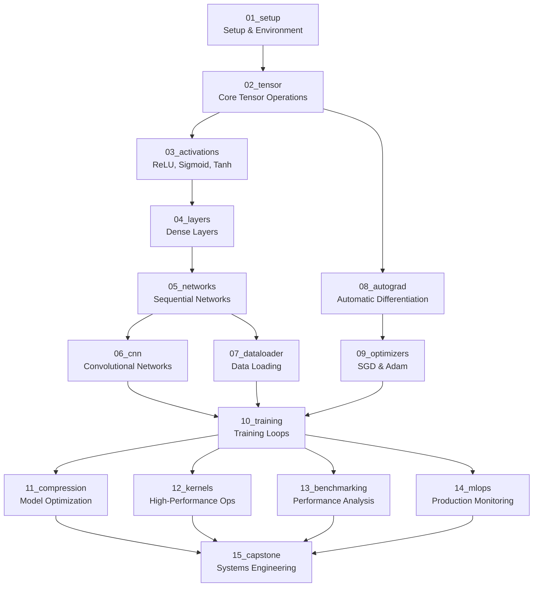

# Tiny🔥Torch 

**Build your own ML framework. Start small. Go deep.**


[](https://github.com/MLSysBook/TinyTorch)
[](https://python.org)
[](https://mlsysbook.github.io/TinyTorch/)

📚 **[Read the Interactive Course →](https://mlsysbook.github.io/TinyTorch/)**

---

## 🏗️ **The Big Picture: Why Build from Scratch?**

**Most ML education teaches you to _use_ frameworks.** TinyTorch teaches you to _build_ them.

```python
Traditional ML Course:          TinyTorch Approach:
├── import torch               ├── class Tensor:
├── model = nn.Linear(10, 1)   │     def __add__(self, other): ...
├── loss = nn.MSELoss()        │     def backward(self): ...
└── optimizer.step()           ├── class Linear:
                               │     def forward(self, x):
                               │       return x @ self.weight + self.bias
                               ├── def mse_loss(pred, target):
                               │     return ((pred - target) ** 2).mean()
                               ├── class SGD:
                               │     def step(self):
                               └──     param.data -= lr * param.grad

Go from "How does this work?" 🤷 to "I implemented every line!" 💪
```

**Result:** You become the person others come to when they need to understand "how PyTorch actually works under the hood."

---

## 🌟 **What Makes TinyTorch Different**

### **🔬 Build-First Philosophy**
- **No black boxes**: Implement every component from scratch
- **Immediate ownership**: Use YOUR code in real neural networks
- **Deep understanding**: Know exactly how each piece works

### **🚀 Real Production Skills**
- **Professional workflow**: Development with `tito` CLI, automated testing
- **Real datasets**: Train on CIFAR-10, not toy data
- **Production patterns**: MLOps, monitoring, optimization from day one

### **🎯 Progressive Mastery** 
- **Start simple**: Implement `hello_world()` function
- **Build systematically**: Each module enables the next
- **End powerful**: Deploy production ML systems with monitoring

### **⚡ Instant Feedback**
- **Code works immediately**: No waiting to see results
- **Visual progress**: Success indicators and system integration
- **"Aha moments"**: Watch your `ReLU` power real neural networks

---

## 🎯 What You'll Build

* **One Complete ML Framework** — Not 14 separate exercises, but integrated components building into your own PyTorch-style toolkit
* **Fully Functional System** — Every piece connects: your tensors power your layers, your autograd enables your optimizers, your framework trains real networks
* **Real Applications** — Train neural networks on CIFAR-10 using 100% your own code, no PyTorch imports
* **Production-Ready Skills** — Complete ML lifecycle: data loading, training, optimization, deployment, monitoring
* **Deep Systems Understanding** — Know exactly how every component works and integrates because you built it all

---

## 🚀 Quick Start (2 minutes)

### 🧑‍🎓 **Students**

```bash
git clone https://github.com/mlsysbook/TinyTorch.git
cd TinyTorch
pip install -e .
tito system doctor                         # Verify your setup
cd modules/source/01_setup
jupyter lab setup_dev.py                  # Launch your first module
```

### 👩‍🏫 **Instructors**

```bash
# System check
tito system info
tito system doctor

# Module workflow
tito export 01_setup
tito test 01_setup
tito nbdev build                          # Update package
```

---

## 📁 **Repository Structure**

```
TinyTorch/
├── modules/source/           # 15 educational modules
│   ├── 01_setup/            # Development environment setup
│   │   ├── module.yaml      # Module metadata
│   │   ├── README.md        # Learning objectives and guide
│   │   └── setup_dev.py     # Implementation file
│   ├── 02_tensor/           # N-dimensional arrays
│   │   ├── module.yaml
│   │   ├── README.md
│   │   └── tensor_dev.py
│   ├── 03_activations/      # Neural network activation functions
│   ├── 04_layers/           # Dense layers and transformations
│   ├── 05_networks/         # Sequential networks and MLPs
│   ├── 06_cnn/              # Convolutional neural networks
│   ├── 07_dataloader/       # Data loading and preprocessing
│   ├── 08_autograd/         # Automatic differentiation
│   ├── 09_optimizers/       # SGD, Adam, learning rate scheduling
│   ├── 10_training/         # Training loops and validation
│   ├── 11_compression/      # Model optimization and compression
│   ├── 12_kernels/          # High-performance operations
│   ├── 13_benchmarking/     # Performance analysis and profiling
│   ├── 14_mlops/            # Production monitoring and deployment
│   └── 15_capstone/         # Systems engineering capstone project
├── tinytorch/               # Your built framework package
│   ├── core/                # Core implementations (exported from modules)
│   │   ├── tensor.py        # Generated from 02_tensor
│   │   ├── activations.py   # Generated from 03_activations
│   │   ├── layers.py        # Generated from 04_layers
│   │   └── ...              # All your implementations
│   └── utils/               # Shared utilities and tools
├── book/                    # Interactive course website
│   ├── _config.yml          # Jupyter Book configuration
│   ├── intro.md             # Course introduction
│   └── chapters/            # Generated from module READMEs
├── tito/                    # CLI tool for development workflow
│   ├── commands/            # Student and instructor commands
│   └── tools/               # Testing and build automation
└── tests/                   # Integration tests
```

**How It Works:**
1. **Develop in `modules/source/`** - Each module has a `*_dev.py` file where you implement components
2. **Export to `tinytorch/`** - Use `tito export` to build your implementations into a real Python package
3. **Use your framework** - Import and use your own code: `from tinytorch.core.tensor import Tensor`
4. **Test everything** - Run `tito test` to verify your implementations work correctly
5. **Build iteratively** - Each module builds on previous ones, creating a complete ML framework

---

## 📚 Complete Course: 15 Modules

**Difficulty Progression:** ⭐ Beginner → ⭐⭐ Intermediate → ⭐⭐⭐ Advanced → ⭐⭐⭐⭐ Expert → ⭐⭐⭐⭐⭐🥷 Capstone

### **🏗️ Foundations** (Modules 01-05)
* **01_setup**: Development environment and CLI tools
* **02_tensor**: N-dimensional arrays and tensor operations  
* **03_activations**: ReLU, Sigmoid, Tanh, Softmax functions
* **04_layers**: Dense layers and matrix operations
* **05_networks**: Sequential networks and MLPs

### **🧠 Deep Learning** (Modules 06-09)
* **06_cnn**: Convolutional neural networks and image processing
* **07_dataloader**: Data loading, batching, and preprocessing
* **08_autograd**: Automatic differentiation and backpropagation  
* **09_optimizers**: SGD, Adam, and learning rate scheduling

### **⚡ Systems & Production** (Modules 10-14)
* **10_training**: Training loops, metrics, and validation
* **11_compression**: Model pruning, quantization, and distillation
* **12_kernels**: Performance optimization and custom operations
* **13_benchmarking**: Profiling, testing, and performance analysis
* **14_mlops**: Monitoring, deployment, and production systems

### **🎓 Capstone Project** (Module 15)
* **15_capstone**: Capstone project applying systems engineering skills

**Status**: All 15 modules complete with inline tests and educational content

---

## 🔗 **Complete System Integration**

**This isn't 15 isolated assignments.** Every component you build integrates into one cohesive, fully functional ML framework:



### **🎯 How It All Connects**

**Foundation (01-05):** Build your core data structures and basic operations  
**Deep Learning (06-09):** Add neural networks and automatic differentiation  
**Production (10-14):** Scale to real applications with training and production systems  
**Mastery (15):** Optimize and extend your complete framework

**The Result:** A complete, working ML framework built entirely by you, capable of:
- ✅ Training CNNs on CIFAR-10 with 90%+ accuracy
- ✅ Implementing modern optimizers (Adam, learning rate scheduling)  
- ✅ Deploying compressed models with 75% size reduction
- ✅ Production monitoring with comprehensive metrics

### **🚀 Capstone: Optimize Your Framework**

After completing the 14 core modules, you have a **complete ML framework**. The final challenge: make it better through systems engineering.

**Choose Your Focus:**
- ⚡ **Performance Engineering**: GPU kernels, vectorization, memory-efficient operations
- 🧠 **Algorithm Extensions**: Transformer layers, BatchNorm, Dropout, advanced optimizers  
- 🔧 **Systems Optimization**: Multi-GPU training, distributed computing, memory profiling
- 📊 **Benchmarking Analysis**: Compare your framework to PyTorch, identify bottlenecks
- 🛠️ **Developer Tools**: Better debugging, visualization, error messages, testing

**The Constraint:** No `import torch` allowed. Build on **your TinyTorch implementation**. This demonstrates true mastery of ML systems engineering and optimization.

---

## 🧠 Pedagogical Framework: Build → Use → Reflect

### **Example: How You'll Master Activation Functions**

**🔧 Build:** Implement ReLU from scratch
```python
def relu(x):
    # YOU implement this function
    return ???  # What should this be?
```

**🚀 Use:** Immediately use your own code
```python
from tinytorch.core.activations import ReLU  # YOUR implementation!
layer = ReLU()
output = layer.forward(input_tensor)  # Your code working!
```

**💡 Reflect:** See it working in real networks
```python
# Your ReLU is now part of a real neural network
model = Sequential([
    Dense(784, 128),
    ReLU(),           # <-- Your implementation
    Dense(128, 10)
])
```

**This pattern repeats for every component** — you build it, use it immediately, then see how it fits into larger systems.

---

## 🎓 Teaching Philosophy

### **No Black Boxes**
* Build every component from scratch
* Understand performance trade-offs  
* See how engineering decisions impact ML outcomes

### **Production-Ready Thinking**
* Use real datasets (CIFAR-10, MNIST)
* Implement proper testing and benchmarking
* Learn MLOps and system design principles

### **Iterative Mastery**
* Each module builds on previous work
* Immediate feedback through inline testing
* Progressive complexity with solid foundations

---

## 📖 Documentation

### **Interactive Jupyter Book**
- **Live Site**: https://mlsysbook.github.io/TinyTorch/
- **Auto-updated** from source code on every release
- **Complete course content** with executable examples
- **Real implementation details** with solution code

### **Development Workflow**
- **`dev` branch**: Active development and experiments  
- **`main` branch**: Stable releases that trigger documentation deployment
- **Inline testing**: Tests embedded directly in source modules
- **Continuous integration**: Automatic building and deployment

---

## 🛠️ Development Workflow

### **Module Development**
```bash
# Work on dev branch
git checkout dev

# Edit source modules  
cd modules/source/02_tensor
jupyter lab tensor_dev.py

# Export to package
tito export 02_tensor

# Test your implementation
tito test 02_tensor

# Build complete package
tito nbdev build
```

### **Release Process**
```bash
# Ready for release
git checkout main
git merge dev
git push origin main        # Triggers documentation deployment
```

---

## 📁 Project Structure

```
TinyTorch/
├── modules/source/XX/               # 14 source modules with inline tests
├── tinytorch/core/                  # Your exported ML framework
├── tito/                           # CLI and course management tools
├── book/                           # Jupyter Book source and config
├── tests/                          # Integration tests
└── docs/                           # Development guides and workflows
```

---

## 🧪 Tech Stack

* **Python 3.8+** — Modern Python with type hints
* **NumPy** — Numerical foundations  
* **Jupyter Lab** — Interactive development
* **Rich** — Beautiful CLI output
* **NBDev** — Literate programming and packaging
* **Jupyter Book** — Interactive documentation
* **GitHub Actions** — Continuous integration and deployment

---

## ✅ Verified Learning Outcomes

Students who complete TinyTorch can:

✅ **Build complete neural networks** from tensors to training loops  
✅ **Implement modern ML algorithms** (Adam, dropout, batch norm)  
✅ **Optimize performance** with profiling and custom kernels  
✅ **Deploy production systems** with monitoring and MLOps  
✅ **Debug and test** ML systems with proper engineering practices  
✅ **Understand trade-offs** between accuracy, speed, and resources  

---

## 🏃‍♀️ Getting Started

### **Option 1: Interactive Course**
👉 **[Start Learning Now](https://mlsysbook.github.io/TinyTorch/)** — Complete course in your browser

### **Option 2: Local Development**
```bash
git clone https://github.com/mlsysbook/TinyTorch.git
cd TinyTorch
pip install -e .
tito system doctor
cd modules/source/01_setup
jupyter lab setup_dev.py
```

### **Option 3: Instructor Setup**
```bash
# Clone and verify system
git clone https://github.com/mlsysbook/TinyTorch.git
cd TinyTorch
tito system info

# Test module workflow
tito export 01_setup && tito test 01_setup
```

---

**🔥 Ready to build your ML framework? Start with TinyTorch and understand every layer. _Start Small. Go Deep._**
