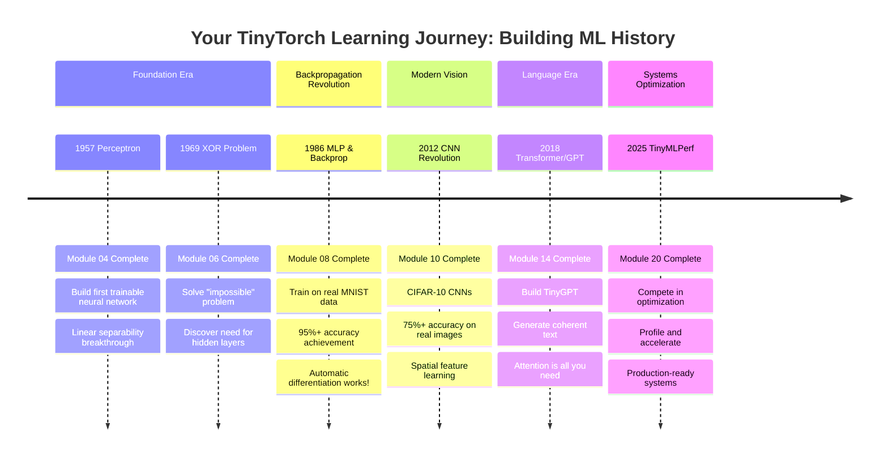

# Your TinyTorch Journey: From First Neural Network to Modern AI

Follow the historical evolution of ML while building every breakthrough yourself. Each milestone represents a real achievement you'll accomplish with your own code - from the 1957 Perceptron to modern transformers.

## Visual Progress Timeline

### The Complete Journey: 60+ Years of ML Evolution



## Module Progression Map

### Part I: Neural Network Foundations (Modules 1-8)
**Timeline: 1957-1986 | 8 weeks**

| Week | Module | Historical Context | What You Build | Unlock Achievement |
|------|--------|-------------------|-----------------|-------------------|
| 1 | Setup | - | Development environment | Ready to begin journey |
| 2 | Tensor | Mathematical foundations | N-dimensional arrays with gradients | Core data structure |
| 3 | Activations | Neuron modeling | ReLU, Sigmoid, Softmax | Nonlinearity unlocked |
| 4 | Layers | **1957: Perceptron Era** | Linear layers, Module system | ✨ **Build Perceptron!** |
| 5 | Losses | Error measurement | MSE, CrossEntropy | Can measure learning |
| 6 | Autograd | **1969: XOR Problem** | Automatic differentiation | ✨ **Solve XOR!** |
| 7 | Optimizers | Gradient descent | SGD, Adam | Training acceleration |
| 8 | Training | **1986: Backprop Revolution** | Complete training loops | ✨ **Train MNIST MLP!** |

**Milestone Unlocked**: After Module 8, you can train real neural networks on actual datasets!

---

### Part II: Computer Vision (Modules 9-10)
**Timeline: 2012 CNN Revolution | 2 weeks**

| Week | Module | Historical Context | What You Build | Unlock Achievement |
|------|--------|-------------------|-----------------|-------------------|
| 9 | Spatial | Convolution breakthrough | Conv2d, MaxPool2d | Spatial intelligence |
| 10 | DataLoader | **2012: AlexNet moment** | Efficient data pipelines | ✨ **75%+ CIFAR-10!** |

**Milestone Unlocked**: Modern computer vision with CNNs on real images!

---

### Part III: Language Models (Modules 11-14)
**Timeline: 2017-2018 Transformer Era | 4 weeks**

| Week | Module | Historical Context | What You Build | Unlock Achievement |
|------|--------|-------------------|-----------------|-------------------|
| 11 | Tokenization | Text processing | Vocabulary building | Text to numbers |
| 12 | Embeddings | Word representations | Token & positional encoding | Semantic space |
| 13 | Attention | Attention mechanism | Multi-head attention | Sequence understanding |
| 14 | Transformers | **2018: GPT Era** | Complete transformer blocks | ✨ **TinyGPT works!** |

**Milestone Unlocked**: Generate text with transformers you built from scratch!

---

### Part IV: Systems Optimization (Modules 15-20)
**Timeline: Modern ML Engineering | 6 weeks**

| Week | Module | Historical Context | What You Build | Unlock Achievement |
|------|--------|-------------------|-----------------|-------------------|
| 15 | Mixed Precision | Memory optimization | FP16 training | 2x speedup |
| 16 | Acceleration | Hardware optimization | Vectorization, caching | 10x speedups |
| 17 | Quantization | Model compression | INT8 inference | 4x memory reduction |
| 18 | Compression | Pruning & distillation | Sparse models | 90% size reduction |
| 19 | Caching | Memory optimization | KV-cache for generation | Faster inference |
| 20 | Benchmarking | **2025: TinyMLPerf** | Competition framework | ✨ **Complete Framework!** |

**Final Achievement**: Production-ready ML systems engineer!

---

## Capability Checkpoints

Track your progress through 16 capability milestones:

```{admonition} Your Capability Progress
:class: note
Each checkpoint represents a fundamental ML systems capability you've mastered.
```

| Checkpoint | Capability Question | Modules Required | Status |
|------------|-------------------|------------------|--------|
| 00 | Can I set up my environment? | 01 | ⬜ Setup |
| 01 | Can I manipulate tensors? | 02 | ⬜ Foundation |
| 02 | Can I add nonlinearity? | 03 | ⬜ Intelligence |
| 03 | Can I build network layers? | 04 | ⬜ Components |
| 04 | Can I measure loss? | 05 | ⬜ Networks |
| 05 | Can I compute gradients? | 06 | ⬜ Learning |
| 06 | Can I optimize parameters? | 07 | ⬜ Optimization |
| 07 | Can I train models? | 08 | ⬜ Training |
| 08 | Can I process images? | 09 | ⬜ Vision |
| 09 | Can I load data efficiently? | 10 | ⬜ Data |
| 10 | Can I process text? | 11 | ⬜ Language |
| 11 | Can I create embeddings? | 12 | ⬜ Representation |
| 12 | Can I implement attention? | 13 | ⬜ Attention |
| 13 | Can I build transformers? | 14 | ⬜ Architecture |
| 14 | Can I profile performance? | 15-19 | ⬜ Systems |
| 15 | Can I optimize and compete? | 20 | ⬜ Mastery |

Use `tito checkpoint status` to see your real-time progress!

---

## Historical Achievements You'll Recreate

### 1957: The Perceptron
**Your Achievement**: Build the first trainable neural network
- Frank Rosenblatt's revolutionary machine
- Proves machines can learn from examples
- Foundation for all modern AI

### 1969: The XOR Problem  
**Your Achievement**: Solve the "impossible" problem
- Minsky & Papert's challenge that stopped AI research
- Demonstrates need for hidden layers
- Your solution proves multi-layer networks work

### 1986: The Backpropagation Revolution
**Your Achievement**: Train on real handwritten digits
- Rumelhart, Hinton & Williams unlock deep learning
- 95%+ accuracy on MNIST
- Automatic differentiation changes everything

### 2012: The CNN Breakthrough
**Your Achievement**: 75%+ accuracy on CIFAR-10
- AlexNet moment for computer vision
- Spatial features dominate vision tasks
- Your CNN matches modern baselines

### 2018: The Transformer Era
**Your Achievement**: Generate text with TinyGPT
- Attention mechanisms revolutionize NLP
- Universal architecture for all modalities
- Your implementation generates coherent text

### 2025: Production ML Systems
**Your Achievement**: Complete optimization pipeline
- Profile, optimize, and deploy
- TinyMLPerf competition framework
- You're now an ML systems engineer

---

## Start Your Journey

Ready to begin? Start with [Module 01: Setup](chapters/01-setup.md) and begin building your own ML framework from scratch!

```{admonition} Track Your Progress
:class: tip
Use the TinyTorch CLI to track your journey:
- `tito checkpoint status` - See your capability progress
- `tito checkpoint timeline` - Visualize your learning path
- `tito module complete XX` - Complete modules and unlock achievements
```

**Remember**: You're not just learning ML - you're recreating 60+ years of breakthroughs with your own hands. Each line of code you write is building toward complete ML systems mastery.