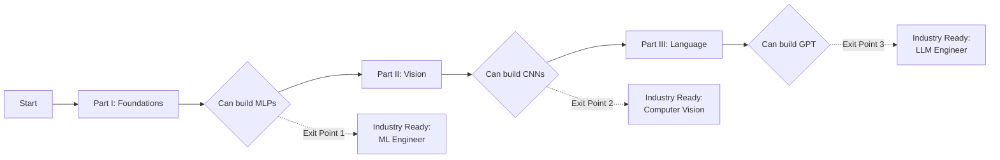

# TinyTorch Three-Part Learning Journey 🚀

## Overview
TinyTorch is structured as a progressive three-part journey, where each part builds toward a concrete achievement. Students can complete any part and have built something meaningful!

## Part I: Foundations (Modules 1-5) 
**"I can build neural networks from scratch!"**

### Modules
1. **01_setup** - Development environment and tools
2. **02_tensor** - Core data structure and operations
3. **03_activations** - Non-linearity (the key to intelligence!)
4. **04_layers** - Dense layers and matrix operations
5. **05_networks** - Multi-layer neural networks

### Capstone Achievement
✅ **XORNet** - Solve the classic XOR problem that proves you understand non-linear learning

### What You Learn
- How tensors store and manipulate data
- Why activation functions enable intelligence
- How layers compose into networks
- Memory layouts and computational complexity
- Building blocks of all neural networks

---

## Part II: Computer Vision (Modules 6-11)
**"I can build CNNs that classify real images!"**

### Modules
6. **06_spatial** - Convolutions and pooling for image processing
7. **07_dataloader** - Efficient data pipelines and batching
8. **08_normalization** - BatchNorm and LayerNorm for stable training
9. **09_autograd** - Automatic differentiation and computational graphs
10. **10_optimizers** - SGD, Adam, and gradient descent
11. **11_training** - Complete training loops with validation

### Capstone Achievement
✅ **CIFAR-10 CNN** - Classify real 32x32 color images at 55%+ accuracy (5.5x better than random!)

### What You Learn
- How convolutions extract spatial features
- Data pipeline engineering for real datasets
- Why normalization prevents gradient problems
- How autograd enables learning
- Memory vs speed tradeoffs in optimization
- Production training techniques (checkpointing, early stopping)

---

## Part III: Language Models (Modules 12-17)
**"I can build transformers that generate text!"**

### Modules
12. **12_embeddings** - Token embeddings and positional encoding
13. **13_attention** - Multi-head attention mechanisms
14. **14_transformers** - Transformer blocks and architectures
15. **15_generation** - Autoregressive decoding and sampling strategies
16. **16_regularization** - Dropout, weight decay, and robustness
17. **17_systems** - Production deployment, optimization, and monitoring

### Capstone Achievement
✅ **TinyGPT** - Generate coherent text character-by-character using transformers

### What You Learn
- Why embeddings are often the largest parameters
- O(N²) attention complexity and memory bottlenecks
- How transformers process sequences in parallel
- Temperature, top-k, nucleus sampling tradeoffs
- Production ML systems engineering
- Deployment, monitoring, and optimization

---

## Progressive Learning Path



## Natural Exit Points

### After Part I (Modules 1-5)
- **You've built**: Neural networks from scratch
- **You understand**: Core ML building blocks
- **Industry relevance**: Ready for ML engineering roles
- **Concrete proof**: Working XORNet

### After Part II (Modules 6-11)
- **You've built**: Complete CNN training pipeline
- **You understand**: Real data processing at scale
- **Industry relevance**: Ready for computer vision roles
- **Concrete proof**: CIFAR-10 at 55% accuracy

### After Part III (Modules 12-17)
- **You've built**: Transformer-based language model
- **You understand**: Modern LLM architectures
- **Industry relevance**: Ready for NLP/LLM engineering
- **Concrete proof**: Text-generating TinyGPT

---

## Alignment with MLSysBook.ai

This structure perfectly complements the [ML Systems textbook](https://mlsysbook.ai):

| Book Section | TinyTorch Part | What You Build |
|-------------|----------------|----------------|
| Ch 1-4: Foundations | Part I (Modules 1-5) | Neural Networks |
| Ch 5-8: Design Principles | Part II (Modules 6-11) | CNNs & Training |
| Ch 9-12: Performance | Part III (Modules 12-17) | Transformers |
| Ch 13-20: Production | Integrated Throughout | Real Systems |

## Why This Structure Works

1. **Clear Progression**: Each part builds on the previous
2. **Concrete Achievements**: XOR → CIFAR-10 → GPT
3. **Industry Aligned**: MLP → CNN → Transformer mirrors ML history
4. **Flexible Duration**: Complete 1, 2, or all 3 parts based on course length
5. **Systems Focus**: Every module teaches ML systems engineering, not just algorithms

---

## Module Dependency Graph

```
Part I (Foundations)
├── 01_setup
├── 02_tensor ← Foundation for everything
├── 03_activations ← Requires tensor
├── 04_layers ← Requires tensor, activations  
└── 05_networks ← Requires layers

Part II (Computer Vision)
├── 06_spatial ← Requires tensor, layers
├── 07_dataloader ← Requires tensor
├── 08_normalization ← Requires tensor, layers
├── 09_autograd ← Requires tensor, networks
├── 10_optimizers ← Requires autograd
└── 11_training ← Requires all above

Part III (Language Models)
├── 12_embeddings ← Requires tensor, layers
├── 13_attention ← Requires tensor, layers
├── 14_transformers ← Requires attention, normalization
├── 15_generation ← Requires transformers
├── 16_regularization ← Enhancement for all models
└── 17_systems ← Production engineering
```

---

## For Instructors

### Semester Planning Options

**Quarter System (10 weeks)**
- Weeks 1-4: Part I (Foundations)
- Weeks 5-9: Part II (Computer Vision)
- Week 10: Final project with XORNet or CIFAR-10

**Semester System (15 weeks)**
- Weeks 1-3: Part I (Foundations)
- Weeks 4-8: Part II (Computer Vision)
- Weeks 9-14: Part III (Language Models)
- Week 15: Final project with TinyGPT

**Intensive Bootcamp (6 weeks)**
- Week 1: Part I (Foundations) - Fast pace
- Weeks 2-3: Part II (Computer Vision)
- Weeks 4-5: Part III (Language Models)
- Week 6: Capstone project

### Assessment Milestones

1. **Part I Assessment**: Working XORNet (25% of grade)
2. **Part II Assessment**: CIFAR-10 >50% accuracy (35% of grade)
3. **Part III Assessment**: Working TinyGPT (40% of grade)

Each part has clear, measurable success criteria!