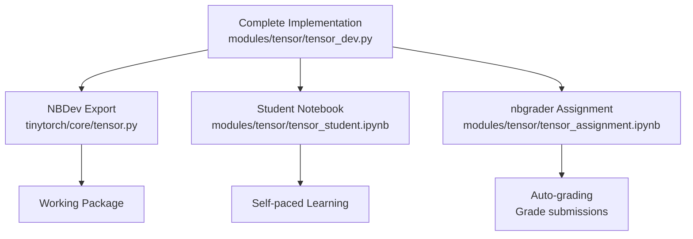

# NBGrader Integration Guide

This guide explains how TinyTorch integrates with nbgrader for enhanced assignment management and auto-grading.

## Overview

TinyTorch supports **three levels of student interaction**:

1. **🎓 Self-Learning**: Regular student notebooks with rich educational content
2. **📝 Assignments**: nbgrader-compatible assignments with auto-grading
3. **🔧 Production**: Working package with instructor solutions

## Architecture

### Instructor Development Flow



### Dual Marking System

TinyTorch supports both marking systems simultaneously:

```python
# Enhanced module with both systems
class Tensor:
    def __init__(self, data):
        """
        Create a tensor from data.
        
        Args:
            data: Input data (scalar, list, or numpy array)
        """
        #| exercise_start
        #| hint: Use np.array() to convert input data
        #| solution_test: tensor.shape should match input shape
        #| difficulty: easy
        
        ### BEGIN SOLUTION
        self._data = np.array(data)
        ### END SOLUTION
        
        #| exercise_end
        
    ### BEGIN HIDDEN TESTS
    def test_tensor_creation(self):
        """Hidden tests for auto-grading"""
        t = Tensor([1, 2, 3])
        assert t.shape == (3,)
        assert isinstance(t.data, np.ndarray)
    ### END HIDDEN TESTS
```

## Usage

### Generate Student Notebooks (Self-Learning)

```bash
# Generate regular student notebooks
python bin/generate_student_notebooks.py --module tensor

# Result: modules/tensor/tensor_student.ipynb
# - Rich educational content
# - TODO placeholders with hints
# - Self-paced learning
```

### Generate nbgrader Assignments

```bash
# Generate nbgrader-compatible assignments
python bin/generate_student_notebooks.py --module tensor --nbgrader

# Result: modules/tensor/tensor_assignment.ipynb
# - nbgrader markers preserved
# - Auto-grading ready
# - Hidden tests included
```

### Batch Generation

```bash
# Generate all modules
python bin/generate_student_notebooks.py --all
python bin/generate_student_notebooks.py --all --nbgrader
```

## nbgrader Configuration

### Setup nbgrader Environment

```bash
# Install nbgrader
pip install nbgrader

# Initialize nbgrader in course directory
nbgrader quickstart course_name

# Configure nbgrader
jupyter nbextension install --sys-prefix --py nbgrader --overwrite
jupyter nbextension enable --sys-prefix --py nbgrader
jupyter serverextension enable --sys-prefix --py nbgrader
```

### Course Configuration

Create `nbgrader_config.py`:

```python
# nbgrader_config.py
c = get_config()

# Course settings
c.CourseDirectory.course_id = "ml-systems-tinytorch"
c.CourseDirectory.source_directory = "assignments"
c.CourseDirectory.release_directory = "release"
c.CourseDirectory.submitted_directory = "submitted"
c.CourseDirectory.autograded_directory = "autograded"
c.CourseDirectory.feedback_directory = "feedback"

# Auto-grading settings
c.Execute.timeout = 300  # 5 minutes per cell
c.Execute.allow_errors = True
c.Execute.error_on_timeout = True

# Feedback settings
c.ClearSolutions.code_stub = {
    "python": "# YOUR CODE HERE\nraise NotImplementedError()"
}
```

## Assignment Workflow

### 1. Create Assignment

```bash
# Copy assignment notebook to nbgrader source
cp modules/tensor/tensor_assignment.ipynb assignments/tensor/tensor.ipynb

# Generate assignment
nbgrader generate_assignment tensor

# Release to students
nbgrader release_assignment tensor
```

### 2. Student Submission

Students work on assignments in the `release/tensor/` directory:

```python
# Students see this:
class Tensor:
    def __init__(self, data):
        ### BEGIN SOLUTION
        # YOUR CODE HERE
        raise NotImplementedError()
        ### END SOLUTION
        
    # Hidden tests run automatically
```

### 3. Auto-grading

```bash
# Collect submissions
nbgrader collect tensor

# Auto-grade submissions
nbgrader autograde tensor

# Generate feedback
nbgrader generate_feedback tensor
```

## Advanced Features

### 1. Partial Credit

```python
# In instructor version
class Tensor:
    def multiply(self, other):
        ### BEGIN SOLUTION
        # Full implementation (10 points)
        result = self._data * other._data
        return Tensor(result)
        ### END SOLUTION
        
### BEGIN HIDDEN TESTS
def test_multiply_basic():
    """Basic multiplication (5 points)"""
    t1 = Tensor([1, 2, 3])
    t2 = Tensor([2, 3, 4])
    result = t1.multiply(t2)
    assert result.data.tolist() == [2, 6, 12]

def test_multiply_advanced():
    """Advanced multiplication (5 points)"""
    t1 = Tensor([[1, 2], [3, 4]])
    t2 = Tensor([[2, 3], [4, 5]])
    result = t1.multiply(t2)
    assert result.shape == (2, 2)
### END HIDDEN TESTS
```

### 2. Progressive Difficulty

```python
# Easy exercise (auto-graded)
### BEGIN SOLUTION
def add_tensors(a, b):
    return Tensor(a.data + b.data)
### END SOLUTION

# Medium exercise (auto-graded + manual review)
### BEGIN SOLUTION
def matrix_multiply(a, b):
    # Implementation with error handling
    if a.shape[1] != b.shape[0]:
        raise ValueError("Incompatible shapes")
    return Tensor(np.dot(a.data, b.data))
### END SOLUTION

# Hard exercise (manual grading)
"""
Design Question: Explain your tensor broadcasting strategy.
Discuss trade-offs between memory usage and computation speed.
"""
```

### 3. Integration with TinyTorch CLI

Extend the `tito` CLI to support nbgrader:

```bash
# Generate assignments
tito assignment --create tensor

# Grade submissions
tito assignment --grade tensor

# Release feedback
tito assignment --feedback tensor
```

## Benefits

### For Instructors

1. **Dual-purpose content**: Same source creates both learning and grading materials
2. **Auto-grading**: Reduces grading workload significantly
3. **Consistent evaluation**: Standardized testing across students
4. **Detailed feedback**: Automatic feedback generation
5. **Grade tracking**: Integration with LMS systems

### For Students

1. **Immediate feedback**: Know if implementation is correct
2. **Progressive learning**: Build on verified foundations
3. **Flexible learning**: Choose between self-paced or assignment modes
4. **Real testing**: Same tests used in production package

### For Course Management

1. **Scalability**: Handle large class sizes
2. **Consistency**: Same quality across all students
3. **Analytics**: Track student progress and common issues
4. **Reusability**: Assignments work across semesters

## Migration Strategy

### Phase 1: Enhanced Marking (Current)
- Add nbgrader markers to existing modules
- Enhance student notebook generator
- Test dual generation system

### Phase 2: nbgrader Integration
- Set up nbgrader environment
- Configure auto-grading workflows
- Train instructors on new system

### Phase 3: Full Deployment
- Deploy to production course
- Collect feedback and iterate
- Expand to all modules

## Best Practices

### 1. Test Design

```python
# Good: Specific, focused tests
def test_tensor_creation():
    t = Tensor([1, 2, 3])
    assert t.shape == (3,)
    assert t.data.tolist() == [1, 2, 3]

# Good: Edge case testing
def test_tensor_empty():
    t = Tensor([])
    assert t.shape == (0,)
    assert t.size == 0
```

### 2. Student Guidance

```python
# Good: Clear instructions
def forward(self, x):
    """
    Forward pass through the layer.
    
    Args:
        x: Input tensor of shape (batch_size, input_size)
    
    Returns:
        Output tensor of shape (batch_size, output_size)
    
    TODO: Implement matrix multiplication and bias addition
    - Use self.weights for the weight matrix
    - Use self.bias for the bias vector
    - Return Tensor(result)
    """
    ### BEGIN SOLUTION
    result = x.data @ self.weights
    if self.use_bias:
        result += self.bias
    return Tensor(result)
    ### END SOLUTION
```

### 3. Error Handling

```python
# Include error handling in solutions
def matrix_multiply(a, b):
    ### BEGIN SOLUTION
    if a.shape[1] != b.shape[0]:
        raise ValueError(f"Cannot multiply shapes {a.shape} and {b.shape}")
    
    result = np.dot(a.data, b.data)
    return Tensor(result)
    ### END SOLUTION
```

## Troubleshooting

### Common Issues

1. **Marker conflicts**: Ensure nbgrader and TinyTorch markers don't interfere
2. **Cell metadata**: Check that nbgrader cell metadata is preserved
3. **Import issues**: Verify that package imports work in both environments
4. **Test failures**: Ensure hidden tests are robust and fair

### Debug Commands

```bash
# Check notebook structure
nbgrader validate assignment.ipynb

# Test auto-grading locally
nbgrader autograde --create --force assignment

# Validate student notebook
python -c "from modules.tensor.tensor_assignment import *; print('✅ Imports working')"
```

## Conclusion

The enhanced TinyTorch + nbgrader system provides:

- **Flexibility**: Support both self-learning and formal assessment
- **Scalability**: Handle large courses with automated grading
- **Quality**: Consistent, fair evaluation across all students
- **Efficiency**: Reduced instructor workload while maintaining quality
- **Integration**: Seamless with existing TinyTorch architecture

This system transforms TinyTorch from a learning framework into a complete course management solution while preserving its educational philosophy. 