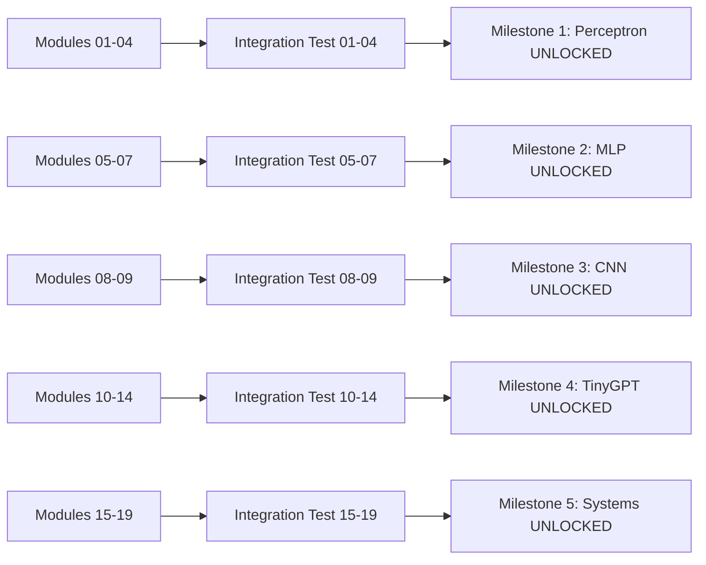

# Milestone Implementation Plan

## 📁 Directory Structure

```
TinyTorch/
├── modules/
│   ├── source/
│   │   ├── 01_tensor/
│   │   ├── 02_activations/
│   │   └── ...
│   └── tests/
│       └── integration/
│           └── test_modules_01_04.py  # Tests that unlock Milestone 1
│
├── milestones/
│   ├── 01_perceptron/
│   │   ├── perceptron_milestone.py      # Main milestone notebook (Colab-ready)
│   │   ├── perceptron_solution.py       # Reference solution
│   │   ├── test_perceptron.py          # Validation tests
│   │   ├── requirements.txt            # Milestone-specific deps
│   │   └── README.md                   # Instructions & rubric
│   │
│   ├── 02_mlp/
│   │   ├── mlp_milestone.py
│   │   ├── mlp_solution.py
│   │   ├── test_mlp.py
│   │   └── README.md
│   │
│   ├── 03_cnn/
│   │   ├── cnn_milestone.py
│   │   ├── cnn_solution.py
│   │   ├── test_cnn.py
│   │   └── README.md
│   │
│   ├── 04_tinygpt/
│   │   ├── tinygpt_milestone.py
│   │   ├── tinygpt_solution.py
│   │   ├── test_tinygpt.py
│   │   └── README.md
│   │
│   └── 05_systems_capstone/
│       ├── systems_capstone.py
│       ├── systems_solution.py
│       ├── test_systems.py
│       └── README.md
```

## 🔓 Milestone Unlock Flow



## 📝 Milestone Template Structure

Each milestone file (`xxx_milestone.py`) follows this structure:

```python
#| default_exp milestones.perceptron
# %% [markdown]
"""
# 🎯 Milestone 1: Perceptron Classifier

## Prerequisites
✅ Completed Modules 01-04 (Tensor, Activations, Layers, Losses)
✅ Passed integration tests for modules 01-04

## Learning Objectives
- Apply your Tensor and Layer implementations to solve a real problem
- Understand linear separability and decision boundaries
- Compare different activation functions in practice
- Profile memory usage of a complete training loop

## What You'll Build
A perceptron classifier that:
1. Trains on a 2D toy dataset (spiral or moons)
2. Visualizes decision boundaries
3. Compares Sigmoid vs ReLU activation
4. Achieves >95% accuracy on linearly separable data
"""

# %%
# Setup and imports
import sys
sys.path.append('../..')
from tinytorch import Tensor
from tinytorch.layers import Linear
from tinytorch.activations import Sigmoid, ReLU
from tinytorch.losses import CrossEntropyLoss
import numpy as np
import matplotlib.pyplot as plt

# %%
# Generate toy dataset
def make_spiral_data(n_points=100, n_classes=2, noise=0.1):
    """Generate spiral dataset for classification."""
    # Implementation provided
    pass

# %% [markdown]
"""
## Part 1: Build the Perceptron Model
Create a simple perceptron using your Linear and activation layers.
"""

# %%
#| export
class Perceptron:
    """Simple perceptron classifier."""
    def __init__(self, input_dim=2, hidden_dim=10, output_dim=2, activation='relu'):
        # TODO: Initialize layers using YOUR implementations
        self.fc1 = None  # Linear layer
        self.activation = None  # Sigmoid or ReLU
        self.fc2 = None  # Output layer

    def forward(self, x):
        # TODO: Implement forward pass
        pass

    def parameters(self):
        # TODO: Return all parameters for optimization
        pass

# %% [markdown]
"""
### 🧪 Test Your Perceptron
"""

# %%
# Test the model initialization
model = Perceptron(input_dim=2, hidden_dim=10, output_dim=2)
test_input = Tensor(np.random.randn(32, 2))
output = model.forward(test_input)
assert output.shape == (32, 2), f"Expected shape (32, 2), got {output.shape}"
print("✅ Perceptron forward pass works!")

# %% [markdown]
"""
## Part 2: Training Loop
Implement a training loop using your optimizer and loss implementations.
"""

# %%
def train_perceptron(model, X_train, y_train, epochs=100, lr=0.01):
    """Train the perceptron model."""
    # TODO: Implement training loop
    # 1. Create optimizer (SGD from your implementation)
    # 2. Create loss function (CrossEntropyLoss)
    # 3. Training loop with forward, backward, step

    history = {'loss': [], 'accuracy': []}

    for epoch in range(epochs):
        # TODO: Your training code here
        pass

    return history

# %% [markdown]
"""
## Part 3: Visualization
Visualize decision boundaries and compare activations.
"""

# %%
def plot_decision_boundary(model, X, y, title="Decision Boundary"):
    """Visualize the decision boundary learned by the model."""
    # TODO: Create a mesh grid and predict on it
    # TODO: Plot contour of predictions
    # TODO: Overlay training points
    pass

# %% [markdown]
"""
## Part 4: Systems Analysis 🔬
Profile the memory usage and computational complexity.
"""

# %%
def profile_perceptron_memory():
    """Profile memory usage during training."""
    import tracemalloc

    # TODO: Profile memory for different batch sizes
    # TODO: Analyze memory growth with model size
    pass

# %% [markdown]
"""
## Part 5: Comparison Study
Compare Sigmoid vs ReLU activation functions.
"""

# %%
def compare_activations():
    """Compare convergence speed and final accuracy."""
    # TODO: Train with Sigmoid
    # TODO: Train with ReLU
    # TODO: Plot learning curves
    # TODO: Compare final accuracies
    pass

# %% [markdown]
"""
## 📊 Milestone Deliverables

Complete ALL of the following to pass this milestone:

1. ✅ Perceptron model using YOUR Tensor/Layer implementations
2. ✅ Training achieves >95% accuracy on spiral dataset
3. ✅ Decision boundary visualization
4. ✅ Memory profiling results
5. ✅ Activation function comparison (Sigmoid vs ReLU)
6. ✅ Systems analysis: complexity and scaling behavior

## 🎯 Success Criteria
- Model trains successfully using your implementations
- Decision boundaries are clearly visualized
- Memory profiling shows expected O(n) scaling with batch size
- Clear difference demonstrated between activations
"""

# %%
# Run all milestone tests
if __name__ == "__main__":
    print("🚀 Running Milestone 1: Perceptron Tests")

    # Generate data
    X_train, y_train = make_spiral_data(n_points=200)

    # Train model
    model = Perceptron(activation='relu')
    history = train_perceptron(model, X_train, y_train)

    # Visualize
    plot_decision_boundary(model, X_train, y_train)

    # Profile
    profile_perceptron_memory()

    # Compare
    compare_activations()

    print("✅ Milestone 1 Complete!")
```

## 🔧 Integration with TITO CLI

```bash
# Check milestone status
tito milestone status
> Milestone 1: Perceptron - LOCKED (Complete modules 01-04 first)
> Milestone 2: MLP - LOCKED
> Milestone 3: CNN - LOCKED
> Milestone 4: TinyGPT - LOCKED
> Milestone 5: Systems - LOCKED

# After completing modules 01-04
tito module complete 04_losses
> ✅ Module 04 exported and tested
> 🎉 Milestone 1: Perceptron UNLOCKED!
> Run: tito milestone start perceptron

# Start milestone
tito milestone start perceptron
> Created: milestones/01_perceptron/perceptron_milestone.ipynb
> Open in Colab or run locally
> Complete all deliverables and run: tito milestone submit perceptron

# Submit milestone
tito milestone submit perceptron
> Running validation tests...
> ✅ All tests passed!
> 🏆 Milestone 1: Perceptron COMPLETE!
```

## 📋 Module Developer Execution Checklist

### For Each Module (01-19):
1. [ ] Implement module following MODULE_PLAN_ENHANCED.md specs
2. [ ] Add systems analysis (memory, complexity, scaling)
3. [ ] Create unit tests within module
4. [ ] Run `tito module complete XX_modulename`
5. [ ] Verify checkpoint passes

### For Each Integration Test:
1. [ ] Create `test_modules_XX_YY.py` in `modules/tests/integration/`
2. [ ] Test that modules XX through YY work together
3. [ ] Verify all exports are accessible
4. [ ] Test complete workflows (e.g., can train a model)

### For Each Milestone:
1. [ ] Create milestone directory structure
2. [ ] Implement milestone notebook with:
   - [ ] Clear prerequisites check
   - [ ] Starter code with TODOs
   - [ ] Test cases for validation
   - [ ] Systems analysis requirements
   - [ ] Visualization requirements
3. [ ] Create reference solution
4. [ ] Create validation tests
5. [ ] Integrate with TITO CLI commands

## 🚨 What's Still Missing for Module Developer

### 1. **Exact Colab Export Process**
```python
# Each milestone needs Colab-specific setup:
# - Google Drive mounting code
# - TinyTorch installation from GitHub
# - Dataset download handling
# - GPU runtime detection
```

### 2. **Grading Rubric Details**
```yaml
Milestone 1 Rubric:
  Model Implementation: 25%
  Training Success: 25%
  Visualization: 20%
  Systems Analysis: 20%
  Comparison Study: 10%
```

### 3. **Dataset Specifications**
```python
# Each milestone needs specific datasets:
Milestone 1: make_spiral_data() or make_moons()
Milestone 2: MNIST (need download function)
Milestone 3: CIFAR-10 (need download function)
Milestone 4: Shakespeare text (need download)
Milestone 5: Use previous datasets
```

### 4. **Progressive Difficulty**
```
Milestone 1: Given most code, fill in key parts
Milestone 2: Given structure, implement training
Milestone 3: Given architecture, implement CNN
Milestone 4: More open-ended, build GPT
Milestone 5: Completely open, optimize everything
```

### 5. **Testing Harness**
```python
# Each milestone needs automated validation:
class MilestoneValidator:
    def check_prerequisites(self, student_id)
    def validate_implementation(self, submission)
    def grade_deliverables(self, submission)
    def generate_feedback(self, results)
```

## 🎯 Module Developer Agent Instructions

**CRITICAL: For the module-developer agent to execute successfully:**

1. **Follow MODULE_PLAN_ENHANCED.md** for module implementation
2. **Create milestones AFTER module groups are complete**:
   - Modules 01-04 → Create Milestone 1
   - Modules 05-07 → Create Milestone 2
   - Modules 08-09 → Create Milestone 3
   - Modules 10-14 → Create Milestone 4
   - Modules 15-19 → Create Milestone 5

3. **Each milestone must be**:
   - Colab-compatible (`.py` files using jupytext format)
   - Self-contained (includes all necessary imports)
   - Testable (includes validation suite)
   - Gradable (clear rubric and success criteria)

4. **Integration flow**:
   ```
   Module Implementation → Unit Tests → Integration Tests → Milestone Unlock → Milestone Implementation
   ```

5. **Use existing checkpoint system**:
   - Milestones map to major checkpoints
   - `tito checkpoint` tracks progress
   - Milestone completion updates checkpoint status

This structure ensures clean separation between learning modules and applied milestones, with clear unlock criteria and Colab compatibility.